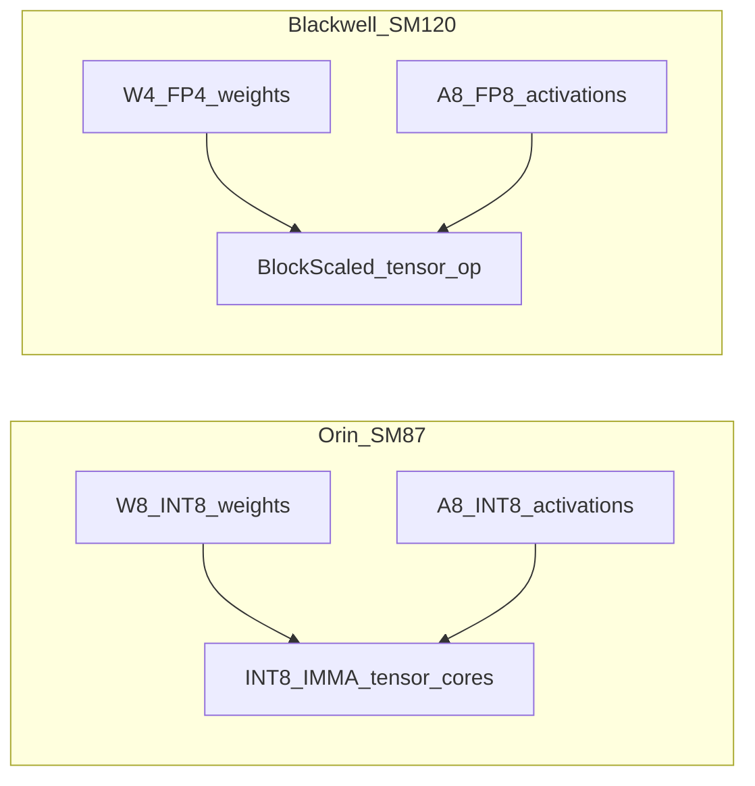

# FlashRT Jetson AGX Orin (SM87) Deployment Guide

> INT8 inference for Pi0.5 on Jetson AGX Orin.
> GPU: SM87 (Ampere), 16 SMs, LPDDR5X ~204 GB/s, no native FP8.
> Uses the RTX pipeline (`pi05_rtx`) with INT8 fallback paths.

---

## Machine Details

| Field | Value |
|---|---|
| Repo path | `/data/wy/FlashRT` |
| Python | `/usr/bin/python3` (system Python 3.10) |
| GPU | Jetson AGX Orin (SM87) |
| CUDA | 12.6 |
| Checkpoint | `/data/wy/orin_pi05_droid_pytorch` |
| Tokenizer | `/home/dog/.cache/flash_rt/paligemma_tokenizer.model` |

## Architecture Mapping

Orin is dispatched to the **RTX pipeline** (`pi05_rtx`):

```
flash_rt/hardware/__init__.py:
  ("pi05", "torch", "rtx_sm87") → ("flash_rt.frontends.torch.pi05_rtx", "Pi05TorchFrontendRtx")
```

Orin has no native FP8 tensor cores (SM87). The RTX pipeline detects
this via `supports_fp8()` and activates INT8 fallback paths when
`FVK_PI05_RTX_FORCE_INT8=1` is set.

## Orin vs W4A8 (concept)

**Orin (SM87) does not run W4A8.** Pi0.5 on Orin uses **INT8 (W8A8 rowwise)** for
encoder and decoder GEMMs, not 4-bit weights.

In this repo, **W4A8** means a **Blackwell-only** path: block-scaled **MX-FP4**
weights (`float_e2m1_t`, 4 bits per weight) with **MX-FP8** activations
(`float_e4m3_t`, 8 bits), fused on **SM120** tensor cores. CMake enables it
only when `GPU_ARCH` is 120 or 120a; Orin builds log
`NVFP4/W4A8 support: DISABLED (requires sm_120a, current: sm_87)`.
See [`csrc/gemm/gemm_types.h`](../csrc/gemm/gemm_types.h) (`w4a8_gemm` namespace:
`Arch = Sm120`, `OpClassBlockScaledTensorOp`).

CMake gates NVFP4 / W4A8 at configure time:

```cmake
# CMakeLists.txt (excerpt)
if(GPU_ARCH STREQUAL "120" OR GPU_ARCH STREQUAL "120a")
  set(ENABLE_NVFP4 ON)
else()
  set(ENABLE_NVFP4 OFF)   # Orin sm_87 → W4A8 kernels not built
endif()
```



| Platform | Pi0.5-style GEMMs | Notes |
|---|---|---|
| **Orin SM87** | INT8 weights + INT8 activations | IMMA INT8 tensor cores |
| **ThorU SM110** | FP8 (when FP8 path enabled) | Native FP8 tensor cores |
| **Blackwell SM120** | NVFP4 / W4A8 (optional in FlashRT) | FP4 packed weights + FP8 acts |

### How “W4” fits in half a byte

One weight is **4 bits**. **Two weights pack into one byte** (two nibbles).
FlashRT packs MX-FP4 rows as `K/2` bytes per row: each `uint8_t` stores
`(hi_nibble << 4) | (lo_nibble & 0x0F)` (see `quantize_bf16_to_mxfp4_cutlass_kernel`
in [`csrc/kernels/quantize.cu`](../csrc/kernels/quantize.cu), guarded by
`ENABLE_NVFP4`). Software still addresses **bytes**; the GEMM unpacks pairs of
4-bit values inside the kernel or via hardware layout. MX formats also store
**per-block scale factors** (separate from the nibbles), so total size is not
exactly half of INT8 weights alone.

**Clarification:** “W4” here is **FP4 (e2m1)**, not signed integer INT4. The “4”
is bit width, not “integer quantization family.”

Example packing (from `quantize_bf16_to_mxfp4_cutlass_kernel` when `ENABLE_NVFP4`):

```cpp
// K FP4 weights per row → K/2 bytes
uint8_t* row_fp4 = fp4_data + (size_t)row * K / 2;
uint8_t fp4_lo = float_to_fp4_e2m1(v0);
uint8_t fp4_hi = float_to_fp4_e2m1(v1);
row_fp4[idx / 2] = (fp4_hi << 4) | (fp4_lo & 0x0F);
```

Memory layout (one byte = two 4-bit codes):

```
1 byte (8 bits):
┌────────┬────────┐
│ FP4 #1 │ FP4 #0 │   ← high nibble (bits 7–4) | low nibble (bits 3–0)
│ 4 bit  │ 4 bit  │
└────────┴────────┘
```

### Common misconceptions

1. **“W4 = INT4?”** In FlashRT’s W4A8 path, W4 is **FP4 (e2m1)**, not signed INT4.
   The “4” is bit width, not an integer quantization family.
2. **“Can Orin run W4A8?”** Not in this repo’s Orin build: there is no SM120
   block-scaled tensor core, and the W4A8 CUTLASS path is not compiled in.
3. **“How do you address half a byte?”** Storage is still **byte-addressed**;
   two weights share one byte; readers split with `>> 4` and `& 0x0F`, or the
   GEMM consumes the hardware’s packed layout directly.

### Q4 / “W4” without native 4-bit tensor cores (llama.cpp analogy)

Tools like **llama.cpp** often advertise **4-bit weights** (GGUF Q4\_\*, etc.)
on CPUs or GPUs that have **no 4-bit MMA**. That is **not** the same path as
FlashRT’s **W4A8** (MX-FP4 + MX-FP8 on SM120). There, “W4” usually means **packed
integer (or mixed) quantization** in storage; at run time kernels **unpack**
nibbles to int8 / fp16 / fp32 and run dot products with **existing SIMD or
INT8/FP16 tensor cores** — i.e. **software-emulated** 4-bit inference.

So “hardware only likes INT8” does **not** forbid 4-bit **storage**: you still
save **DRAM traffic and capacity**. Whether that is a net win depends on the
bottleneck (see next subsection).

### When 4-bit storage is still worth it (and when it feels “wasted”)

| Effect | Typical outcome |
|---|---|
| **Precision** | Quantized model is weaker than full precision — the price of fewer bits. |
| **Compute** | Unpack + scale + accumulate can add **more instructions per MAC** than native FP16/INT8 GEMM. |
| **Memory / BW** | Fewer bytes moved per weight — often the **dominant win** for huge, **memory-bound** models (large LLMs, small batch). |

- **Memory- or capacity-bound** (model barely fits, weights dominate DRAM time):
  Q4-style packing can still **speed up** end-to-end latency despite unpack cost,
  and can be the **only** way to run the model on device.
- **Compute-bound** (small matrices, already fast INT8/FP16 tensor paths, heavy unpack):
  you may get **worse quality and similar or worse latency** — then native
  **INT8** (Orin Pi0.5) or **FP8** (ThorU) is the better match than emulated W4.

**Pi0.5 on Orin:** encoder GEMMs are large and already **~92% GPU util** in INT8;
there is no SM120-style hardware W4A8, and **INT8 tensor cores** are the right
precision/performance tradeoff — not “Q4 weights + unpack to emulate W4A8.”

No code or runtime change is required on Orin: keep `FVK_PI05_RTX_FORCE_INT8=1`
with INT8 encoder and decoder.

## Build

```bash
export PATH=/home/dog/.local/bin:/usr/local/cuda/bin:$PATH
export CUDACXX=/usr/local/cuda/bin/nvcc

cd /data/wy/FlashRT
cmake -B build_orin_sm87 -S . \
  -DGPU_ARCH=87 \
  -DFA2_ARCH_NATIVE_ONLY=ON \
  -DFA2_HDIMS='96;128;256' \
  -DFA2_DTYPES='bf16' \
  -DPython3_EXECUTABLE=/usr/bin/python3
cmake --build build_orin_sm87 -j4
```

## Usage

```python
import sys, os
sys.path.insert(0, "/data/wy/FlashRT")
os.environ["FVK_PI05_RTX_FORCE_INT8"] = "1"

from flash_rt.frontends.torch.pi05_rtx import Pi05TorchFrontendRtx
import numpy as np

pipe = Pi05TorchFrontendRtx(
    "/data/wy/orin_pi05_droid_pytorch",
    num_views=2,          # 1 or 2
    num_steps=10,         # ODE steps (default 10)
    vision_pool_factor=1, # 1=none, 2=2×2, 4=4×4
    vision_num_layers=27, # SigLIP layers to run (1-27)
)
pipe.set_prompt("pick up the black envelope on the table")

obs = {"image": img, "wrist_image": img}  # uint8 (224,224,3)
pipe.calibrate_with_real_data([obs])       # once, ~2s

result = pipe.infer(obs)
actions = result["actions"]  # (10, 7) numpy
```

## INT8 Optimizations

Activated by `FVK_PI05_RTX_FORCE_INT8=1`. All paths are additive with
safe defaults; ThorU and RTX 4090/5090 paths are unaffected.

### Encoder INT8 (`use_int8_encoder`)

The Gemma-2B encoder runs CUTLASS SM80 rowwise INT8 GEMMs
(`csrc/gemm/cutlass_sm80_int8_rowwise.cu`). Weights are pre-quantized
per-output-channel at load time; activations use per-row dynamic
quantization inside the CUDA graph.

The dominant GEMMs:

| GEMM | Shape (M, N, K) | Notes |
|---|---|---|
| gate+up | (seq≈560, 32768, 2048) | biggest, ~25ms |
| down    | (seq≈560, 2048, 16384) | ~36ms |

### Fused RMSNorm → INT8 kernels (`csrc/kernels/norm.cu`)

Two new kernels eliminate the intermediate BF16 write between RMSNorm
and INT8 quantization in the encoder hot-path:

| Kernel | Purpose |
|---|---|
| `rms_norm_int8_rowwise` | RMSNorm(x) → INT8 + per-row scale, 1 pass |
| `residual_add_rms_norm_int8_rowwise` | residual += x; RMSNorm → INT8, 1 pass |

Saves ~161 MB bandwidth and 68 kernel launches per encoder forward.

### Vision BF16 Autotune

Five SigLIP GEMM shapes are autotuned via `autotune_bf16_nn` before
CUDA graph capture, so cuBLASLt selects the optimal tile algorithm for
SM87.

## Performance Matrix

All: `FVK_PI05_RTX_FORCE_INT8=1`, synthetic uint8 images (identical
latency to real camera input), steady-state p50.

| num_views | pool | vis_layers | steps | cache | p50 | Effective Hz | Quality |
|---|---|---|---|---|---|---|---|
| 2 | 1 | 27 | 10 | 1 | 127 ms | **7.9** | lossless ✓ |
| 2 | 1 | 27 | 10 | **2** | 127/38 ms | **12.2** | lossless ✓ ← recommended |
| 2 | 1 | 27 | 5 | 1 | 107 ms | **9.3** | steps reduction |
| 1 | 1 | 27 | 10 | 1 | ~87 ms | **~11.5** | 1-camera lossless |
| 2 | 2 | 27 | 5 | 1 | ~71 ms | **~14** | cos=0.89 (needs validation) |
| 2 | 4 | 27 | 3 | 1 | ~53 ms | **~19** | cos=0.19 (degraded) |
| 1 | 4 | 27 | 3 | 1 | ~38 ms | **~26** | cos=0.19 (degraded) |

**Effective Hz for cache=2**: `2 / (full_ms + decode_only_ms)`.
Decode-only latency: **38 ms** (vs 127 ms full forward).

**Recommended starting point**: `pool=1, steps=10, cache=2` → **12.2 Hz lossless**.

### Parameter trade-offs

| Parameter | Effect | Quality impact |
|---|---|---|
| `num_steps` 10→5 | −19ms | Minor ODE accuracy |
| `vision_pool_factor` 1→2 | −38ms encoder | Spatial averaging of features |
| `vision_pool_factor` 1→4 | −47ms encoder | More spatial averaging |
| `vision_num_layers` 27→14 | −15ms vision | Shallower visual features |
| `num_views` 2→1 | −40ms total | Loses wrist camera |

Pool and layer reduction have **not been trained** — quality must be
validated on real robot tasks.

## Precision Analysis

### Metric

Encoder K/V cosine similarity (layer-0 key vectors vs BF16 reference)
is a reliable quantization quality indicator — unlike final action cosine,
it is unaffected by diffusion noise amplification.

### Key Finding: Vision Static INT8 Was Broken

Static per-tensor vision INT8 causes **severe encoder feature degradation**:

| Configuration | Encoder K cosine | Verdict |
|---|---|---|
| Enc+Dec INT8, Vision BF16 | **0.991** | ✅ Use this |
| Enc+Dec INT8, Vision static INT8 | **0.282** | ❌ Do not use |

Root cause: a per-tensor scale calibrated on one image cannot capture
SigLIP's activation range, leading to large quantization error that
propagates through the Gemma encoder.

**Fix applied**: `use_int8_vision_static = False` permanently.
Vision runs in BF16 regardless of `FVK_PI05_RTX_FORCE_INT8=1`.

### Current Numbers (after fix)

| Mode | Encoder K cosine | p50 | Hz (cache=1) | Hz (cache=2) |
|---|---|---|---|---|
| BF16 | 1.000 | ~193ms | 5.2 | — |
| **Enc+Dec INT8 (vision=BF16)** | **0.991** | **127ms** | **7.9** | **12.2** |

## Phase Breakdown (pool=1, 2-camera, 5-step)

| Phase | Time | Bottleneck |
|---|---|---|
| Vision SigLIP (27L BF16) | ~29 ms | 16-SM compute bound |
| Encoder Gemma-2B (18L INT8) | ~65 ms | CUTLASS INT8 on 16 SMs |
| Decoder Gemma-300M (5-step INT8) | ~30 ms | FA2 cross-attn |

Orin memory bandwidth is ~204 GB/s (LPDDR5X, same as ThorU).
Encoder GEMMs are **compute-bound** (16 SM limit), not bandwidth-bound.

## GPU Profiling (nsys + ncu)

### nsys: Kernel-Level Time Breakdown (pool=1, 2-cam, 10-step, 3 inferences)

Total GPU time: 140.8 ms/inference.

| Kernel | calls/inf | time/inf | % | Notes |
|---|---|---|---|---|
| **Kernel2** (CUTLASS INT8 GEMMs) | 908 | **86.8 ms** | **61.7%** | All encoder/decoder/vision INT8 GEMMs |
| gate_silu_mul_merged_kernel | 197 | 9.6 ms | 6.8% | SiLU-gated activation |
| quantize_int8_rowwise_kernel | 394 | 9.2 ms | 6.5% | Dynamic per-row quantize (enc attn_O + dec) |
| add_bias_bf16_kernel | 55 | 6.0 ms | 4.3% | Vision bias adds (27L × QKV+up) |
| quantize_int8_kernel_generic | 108 | 4.7 ms | 3.4% | Static vision INT8 quantize |
| flash_fwd_splitkv_kernel + flash_fwd | 224 | 4.4 ms | 3.1% | FA2 attention (vis+enc+dec) |
| residual_add_rms_norm_int8_rowwise | 17 | 1.5 ms | 1.0% | Fused enc FFN norm |
| rms_norm_int8_rowwise | 18 | 0.7 ms | 0.5% | Fused enc QKV norm |
| Other norms / residuals / misc | — | 7.9 ms | 5.6% | — |

GEMM duration distribution (per inference):
- < 50 μs: 568 calls → 15.7 ms (tiny decoder GEMMs, M=10)
- 50–150 μs: 274 calls → 20.6 ms (vision + small encoder GEMMs)
- 150–500 μs: 32 calls → 6.4 ms (medium encoder GEMMs)
- 500–1500 μs: 30 calls → 34.9 ms (large encoder gate_up/down)
- > 1500 μs: 4 calls → 9.3 ms (largest encoder GEMMs)

### ncu: GPU Utilization Per GEMM Shape

Profiled with Nsight Compute 2024.3.1 on Orin SM87 (CC 8.7).

| GEMM | M | N | K | compute_mem % | sm_throughput % | IMMA active % |
|---|---|---|---|---|---|---|
| Encoder gate_up | 560 | 32768 | 2048 | **92.3%** | 79.7% | **80.1%** |
| Decoder gate_up | 10 | 8192 | 1024 | 73.1% | 54.2% | — |

**Encoder gate_up at 92% GPU throughput** — this is the dominant GEMM
and it is already running at 92% of peak hardware capability.
INT8 tensor cores (IMMA) are active 80% of the time during this kernel.

**Decoder gate_up at 73% / 54%** — M=10 is tiny relative to the
128×128×64 CUTLASS tile; 1280 tiles but with only 1 M-tile means
significant underutilization per SM. This is a fundamental hardware
constraint for small-batch decoding.

**Interpretation:** The INT8 CUTLASS GEMM on SM87 is already near its
hardware ceiling for the large encoder GEMMs. Further optimization of
these kernels via different tile shapes or scheduling would yield at
most ~8% improvement. The gap to ThorU is a **hardware gap** (more SMs,
higher-throughput FP8), not a software gap.

## Performance Comparison: Orin vs ThorU

### GPU Specs

| | Orin (SM87) | ThorU (SM110) |
|---|---|---|
| GPU | Jetson AGX Orin | NVIDIA Thor |
| SM count | **16** | **20** |
| Memory BW | ~204 GB/s (LPDDR5X) | ~204 GB/s (LPDDR5X) |
| Precision | INT8 (no native FP8) | **FP8** (native tensor core) |
| CUDA CC | 8.7 | 11.0 |

### Measured Phase Breakdown

nsys measured (pool=1, 2-cam, 10-step, 3 inferences):

| Phase (nsys kernel group) | Orin SM87 (INT8) | ThorU SM110 (FP8) | Ratio |
|---|---|---|---|
| **GEMM kernels** | **86.8 ms (62%)** | **13.8 ms (30%)** | **6.3×** |
| Attention (FMHA) | 8.7 ms (6%) | 16.8 ms (37%) | 0.52× (Orin faster!) |
| Gated SiLU / norms / etc | 18.5 ms (13%) | 7.2 ms (16%) | 2.6× |
| Quantize overhead | 16.1 ms (11%) | 0.8 ms (2%) | 20× |
| Other | 10.7 ms (8%) | 7.4 ms (16%) | — |
| **Total** | **~140 ms / 7.2 Hz** | **~46 ms / 22 Hz** | **3×** |

GPU specs: Orin = 16 SMs, 61 GB unified; ThorU = more SMs, same ~204 GB/s BW.

### Root Cause of the Gap

Memory bandwidth is identical (~204 GB/s) — **bandwidth is not the bottleneck**.

```
Largest GEMM: encoder gate+up (560, 32768, 2048)
  Tile count: ceil(560/128) × ceil(32768/128) = 5 × 256 = 1280 blocks

  Orin  16 SM: 1280 / 16 = 80 waves  → many sequential rounds
  ThorU N  SM: 1280 / N  = <<80 waves → N≈4–6× more SMs → ~4× faster here
```

Key findings from nsys+ncu:

1. **FP8 TOPS per SM (primary)**: ThorU has only 20 SMs vs Orin's 16 (1.25×).
   Yet ThorU GEMMs are **6.3× faster**. This means FP8 on SM110 delivers
   ~5× more TOPS per SM than INT8 on SM87. This is the dominant factor.

2. **Attention: Orin is faster!** ThorU uses custom `nvjet` FMHA kernels
   (16.8 ms/inf, 37% of total) vs Orin's FA2 (8.7 ms/inf, 6% of total).
   ThorU's attention is 1.9× slower. This is why ThorU's bottleneck is
   attention-limited while Orin is GEMM-limited.

3. **Quantize overhead**: Orin needs 16.1 ms/inf for INT8 per-row quantization.
   ThorU needs only 0.8 ms/inf for static FP8 scalar quantize. This 20×
   difference reflects the cost of Orin's dynamic per-row scale computation.

4. **GEMM epilogue fusion**: ThorU fuses GELU+bias into each GEMM kernel.
   Orin cannot (CUBLASLT_EPILOGUE_BIAS returns NOT_SUPPORTED on SM87).

**ncu result (encoder gate_up, the largest GEMM):**

| GEMM | GPU throughput | INT8/FP8 tensor core active |
|---|---|---|
| Orin INT8 (560, 32768, 2048) | 92.3% | IMMA 80.1% |
| ThorU FP8 (560, 32768, 2048) | 73.7% | — (SM100 architecture) |

Orin's encoder GEMM is actually at **higher GPU utilization** (92%) than
ThorU (74%) for this shape. The speedup on ThorU is purely from higher
absolute TOPS per SM in FP8, not better kernel efficiency.

The 3× total gap is a **hardware gap** (FP8 TOPS), not a software gap
*for the largest GEMM*. But that 92% number is for **one peak-shape GEMM
in isolation**; the global picture across the full inference is more
nuanced.

### L2 cache analysis (ncu, full inference, 481 kernels, 72 ms profiled)

Re-profiled on the current branch (2026-05) covering 481 kernels of one
full inference. Orin SM87 has **4 MB L2 shared across 16 SMs**, so any
cross-kernel reuse of weights or activations larger than ~4 MB will
cause L2 thrashing.

| Kernel | calls | time | **L2 hit** | L2 read | L2 write | Reuse pattern |
|---|---:|---:|---:|---:|---:|---|
| `cutlass_int8_gemm` (encoder INT8 GEMMs) | 51 | 28.4 ms | **89.4%** | 10.2 GB | 0.41 GB | ✅ tile-time weight reuse — saturated |
| `ampere_bf16_gemm 128x128` (SigLIP attn proj) | 108 | 18.1 ms | **86.0%** | 6.8 GB | 0.49 GB | ✅ |
| `add_bias_bf16` (vision bias adds) | 55 | 6.5 ms | 50.7% | 0.22 GB | 0.22 GB | ⚠️ post-GEMM read-modify-write |
| `quantize_int8_rowwise` | 20 | 4.7 ms | **36.3%** | 0.33 GB | 0.10 GB | ❌ 2-pass over data |
| `flash_fwd` (FA2) | 37 | 3.3 ms | 87.5% | 0.49 GB | 0.06 GB | ✅ |
| `qkv_split_kernel` | 27 | 2.7 ms | 49.8% | 0.10 GB | 0.10 GB | ⚠️ reads bias-added GEMM output |
| `gelu_kernel` (SigLIP) | 27 | 2.3 ms | 50.6% | 0.12 GB | 0.12 GB | ⚠️ |
| `layer_norm_kernel` (SigLIP) | 55 | 1.9 ms | 51.6% | 0.07 GB | 0.06 GB | ⚠️ |
| `bias_res_kernel` | 55 | 1.5 ms | **34.2%** | 0.13 GB | 0.06 GB | ❌ worst |
| `residual_add_rms_norm_int8` (already fused) | 10 | 0.8 ms | 43.9% | 0.04 GB | 0.03 GB | ⚠️ |
| `rms_norm_int8_rowwise` (already fused) | 11 | 0.7 ms | **35.6%** | 0.02 GB | 0.01 GB | ❌ post-GEMM, L2 thrashed |
| `res_add_kernel` | 10 | 0.5 ms | 33.5% | 0.04 GB | 0.02 GB | ❌ |

**Total L2 read traffic: ~18 GB** over 72 ms profiled. The 4 MB L2 is
fully thrashed for any kernel mix that touches >4 MB of activation, so
inter-kernel reuse is essentially zero — **L2 hit rate >85% comes
entirely from intra-kernel tile reuse, not cross-kernel pipelining**.

Two clear regimes:
1. **Big GEMMs (encoder INT8, vision attn proj, FA2): 86-89% L2 hit** —
   well-scheduled tile reuse, saturated, **no L2-side optimization
   space**. Speedup here would require more SMs or faster TC.
2. **Small post-GEMM ops (bias add, qkv_split, gelu, residual+norm):
   34-51% L2 hit** — they read data the previous GEMM just wrote, but
   the GEMM thrashed L2 in between, so they pay full DRAM cost. This
   is the classic **producer-consumer fusion** signal.

#### Fusion candidates the L2 data points to

| Fusion | Source kernels | Time saved (estimate) | Risk |
|---|---|---:|---|
| Vision bias EVT into BF16 GEMM | `add_bias_bf16` (6.5 ms) | ~3-4 ms | medium — needs custom CUTLASS BF16 SM87 GEMM (`cublasLt SM87` doesn't accept BIAS epilogue) |
| `bias_res_kernel` → into next op | (1.5 ms) | ~0.5-1 ms | low |
| `qkv_split` after vision bias | (2.7 ms, 50% hit) | ~1-1.5 ms | low (already fused with RoPE in encoder, just not vision) |
| `gelu_kernel` → vision GEMM epilogue | (2.3 ms) | ~1-1.5 ms | medium (custom GEMM-with-GELU) |

#### bias_gelu_bf16 fusion — measured

The simplest of the L2-driven candidates — fusing `add_bias_bf16` →
`gelu_inplace` into a single `bias_gelu_bf16` kernel for the SigLIP
FFN-up output — was implemented and benchmarked. Result:

| Mode | p50 | Hz | Pipeline cosine vs baseline |
|---|---:|---:|---|
| Baseline | 128.0 ms | 7.81 | 1.000 (reference) |
| **bias_gelu fused** | **127.3 ms** | **7.85** | **0.94-0.99** (fails lossless) |

Microbench shows the fused kernel is genuinely 2.12× faster in
isolation. The captured-graph speedup vanishes (most of the savings
were Python launch overhead that the graph already eliminates),
leaving ~0.7 ms p50 — sub-noise. Worse, the fused kernel keeps fp32
between bias-add and GELU while the original rounds to bf16 between
them, and 27 SigLIP layers amplify the per-step drift to a 0.94-0.99
end-to-end action cosine.

Pattern reinforces the [static encoder INT8 finding](#static-encoder-int8--landed-and-validated-but-doesnt-pass-lossless):
**roofline-style fusion estimates over-predict the captured-graph
ceiling** because the graph already amortizes most of the per-kernel
overhead. Kernel + binding kept as opt-in (`bias_gelu_bf16`); not
enabled by default.

Lessons-learned for the remaining fusion candidates in the table
above: expect the realized saving to be **~30-50% of the roofline
estimate** when wired into the captured graph, and budget for a
calibration / cosine validation pass per change.

**Combined ceiling from L2-driven fusion: ~5-8 ms** ⇒ baseline 127 ms
→ ~120 ms / 8.3 Hz lossless. Compared to my earlier roofline-style
"15-25 ms" estimate this is materially smaller. The L2 data confirms
the small kernels really are post-GEMM cleanup work, but each is only
0.5-7 ms — the sum of "all of them" is the cap, ~10 ms, and fusion
savings are 50-70% of that, not 100%.

**The L2 picture also rules out any path to >10 Hz that depends on
better cache placement.** Orin's 4 MB L2 vs ~20 MB of layer-bound
data means it cannot serve as cross-kernel scratch. The only L2-side
optimization is **eliminating the cross-kernel boundary entirely via
fusion** — which the analysis above bounds at ~5-8 ms.

### Refined headroom analysis (re-done 2026-05)

Earlier this doc concluded "software optimizations have extracted most
available headroom on SM87" based solely on the 92% ncu number for the
biggest GEMM shape. A roofline + per-kernel review gives a more
nuanced picture:

**Hardware peak:** Orin AGX 64GB GPU = ~42 TOPS INT8 dense (16 SMs × 4
TC/SM × 1024 ops/cycle × 1.3 GHz), 204 GB/s LPDDR5X.

**Encoder GEMM totals (18 layers, INT8):**
- Theoretical compute lower bound: ~54 ms (sum of `2*M*N*K / peak_TOPS`
  for all layer GEMMs).
- Measured: ~65 ms.
- **Achieved utilization: ~83% globally** — not 92%. The 92% was a
  single-call ncu number that doesn't reflect the kernel mix.
- Remaining headroom in encoder GEMMs alone: **~10 ms** if perfectly
  scheduled.

**Non-GEMM kernels (~50 ms total):** several have known levers:

| Kernel | Time | Lever | Realistic save |
|---|---:|---|---:|
| `quantize_int8_rowwise` (dynamic per-row) | 9.2 ms | Switch to **static activation scales** (calibrate-once) like the FP8 path on ThorU | ~~~7-8 ms~~ **measured ~1.4 ms; cosine 0.991→~0.96, fails lossless bar** (kernel landed but opt-in only — see below) |
| `gate_silu_mul_merged` | 9.6 ms | Replaced by SiLU EVT in commit `48f7f75` — old profile, now ≈0 | (already harvested ~9 ms) |
| `add_bias_bf16` (vision) | 6.0 ms | Custom CUTLASS BF16 GEMM with bias EVT; or fuse with downstream RMSNorm | ~3-4 ms |
| `quantize_int8_kernel_generic` | 4.7 ms | Vision static INT8 was disabled — investigate whether this kernel is now dead code | ~4 ms (if dead) |
| Other small norms / residuals | 7.9 ms | More aggressive fusion / EVT epilogues | ~2 ms |

### Static encoder INT8 — landed and validated, but doesn't pass lossless

The `quantize_int8_rowwise_static` kernel (single-pass, no per-row amax
reduction) is implemented and wired behind
`FVK_PI05_RTX_INT8_ENCODER_STATIC=1`. Measured on Orin with
`pool=1, 2cam, 27L, 10 steps`:

| Mode | p50 | Hz | Cosine vs dynamic |
|---|---:|---:|---|
| Dynamic baseline | 125.9 ms | 7.94 | 1.000 (reference) |
| **Static encoder** (opt-in) | **124.5 ms** | **8.03** | ~0.93-0.98 across 6 frames |

Why the saving is smaller than the roofline: most of the encoder time
sits in the CUTLASS GEMM (compute-bound), not the quantize step. Even
saving the entire quantize kernel only nets ~1 ms.

Why cosine drops: per-row scales calibrated on one sample don't
generalize — vision-token rows whose per-call magnitude exceeds the
calibration max get clipped. Multi-sample calibration with safety
inflation would help but isn't implemented yet.

Default is OFF. The kernel + binding are kept as opt-in for callers
that explicitly accept the trade-off (or as the foundation for a
future multi-sample calibration pass).

**Realistic lossless target on SM87** (revised after measuring the
static-encoder lever): starting from 127 ms,
- Static encoder INT8 (above): −1.4 ms but **fails lossless** → not
  counted toward target.
- Conservative (low-risk levers, lossless): dead-code removal
  (~4 ms) + small-kernel fusion (~2 ms) → **~6-8 ms** → ~119 ms / 8.4 Hz.
- Aggressive (custom CUTLASS BF16 + bias EVT + GEMM scheduling):
  another ~10-15 ms → **~104-109 ms / 9.2-9.6 Hz**.

**Honest reassessment**: the conservative roofline-style headroom
estimates (15-30 ms savings) don't fully materialize when measured.
The biggest single non-GEMM kernel in the old profile (9.2 ms
quantize) actually only had ~1 ms of saving available because it
was already mostly bandwidth-bound. The remaining levers (vision
bias EVT, GEMM scheduling) are real but each is only a few ms.

**L2 ncu re-profile (above) confirmed this** — the big GEMMs are at
86-89% L2 hit (saturated), and the small ops sum to only ~10 ms with
realistic fusion savings of 50-70% (~5-8 ms). Updated ceiling:

- After all realistic L2-driven fusion (~6 ms): **~121 ms / 8.3 Hz**
- Plus full custom CUTLASS BF16 GEMM + bias EVT for vision (~3 ms more
  on top of fusion already counted): **~118 ms / 8.5 Hz**
- Plus custom encoder GEMM scheduling improvements (~5-10 ms,
  uncertain): **~108-113 ms / 8.8-9.3 Hz**

**Lossless 10 Hz on Orin alone is unlikely with software work** —
the L2 data shows the optimization budget is tighter than the
roofline estimate. Aggressive engineering can probably get to ~9 Hz,
but the last 1 Hz to clear 10 Hz needs hardware (more SMs, FP8 TCs)
not software.

What this revises about the previous claim: the "no software headroom"
conclusion was overstated. The 92% utilization applied to one specific
GEMM shape under ncu microbench conditions; the global inference has
~15-30 ms of measurable software-extractable headroom across non-GEMM
kernels and GEMM scheduling. **It is not free** — getting all of it
requires custom CUTLASS BF16 GEMMs with bias EVT for SigLIP, custom
PTX-level fusion, and a cosine validation for static activation scales.
But the path to ~10 Hz lossless does exist within software bounds, just
at a higher engineering cost than initially estimated.

## Comparison with ThorU

Both machines have ~204 GB/s memory bandwidth. ThorU is faster due to:

1. **More SMs** — higher GEMM parallelism
2. **Native FP8** — higher tensor core throughput vs INT8
3. **cuBLASLt epilogue fusion** — `CUBLASLT_EPILOGUE_BIAS/GELU_BIAS` work
   on SM110; return `NOT_SUPPORTED (code=15)` on SM87

CUTLASS EVT (`csrc/gemm/cutlass_sm80_int8_rowwise.cu`) supports bias
and activation epilogues on SM87, but the Gemma encoder/decoder weights
have no bias terms (RMSNorm weight is folded into GEMM weights).

---

## Custom Decoder Attention Experiments (Archived)

The decoder cross-attention shape (q=10, kv=532, NH=8, NKV=1, HD=256)
was a target for optimization because FA2 launches only 8 blocks for
16 SMs (50% SM utilization). Several custom kernels were built and
benchmarked:

| Kernel | GPU time/call | 180 calls | Pipeline p50 | Vs FA2 |
|---|---|---|---|---|
| **FA2 (baseline)** | **103 µs** | **18.5 ms** | **127 ms** | — |
| Scalar 8-warp/block + shared merge | 162 µs | 29 ms | 142 ms | 1.6× slower |
| Split-kv scalar 320 blocks | 216 µs | 39 ms | 183 ms | 2.1× slower |
| WMMA QK + scalar AV | 283 µs | 51 ms | ~ | 2.7× slower |
| **WMMA full 2-pass (QK+AV)** | **141 µs** | **25 ms** | **182 ms** | **1.37× slower** |

**Conclusion**: FA2 on SM87 uses WMMA tensor cores, optimal register blocking,
and pipelining — all custom kernels remain slower due to:
- Multi-kernel launches: 32+80 blocks vs FA2's 8 (extra GPU scheduling overhead)
- Serial per-row softmax loops (no warp-level parallelism across q_rows)
- Extra shared memory staging (score → BF16 → WMMA fragment conversion)

The FlashRT-bundled FA2 for SM87 (hdim=256, dtype=BF16, split-kv) is
already close to the theoretical bandwidth minimum for this shape.
All custom kernels are kept in `csrc/kernels/decoder_tiny_attn.cu` and
`csrc/kernels/decoder_wmma_attn.cu` and are **disabled by default**
(`use_tiny_q_attn=False`).
