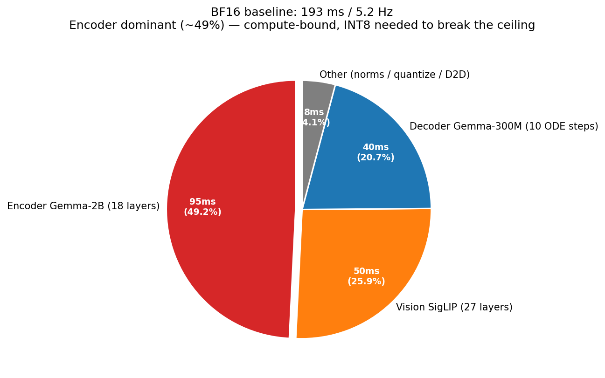
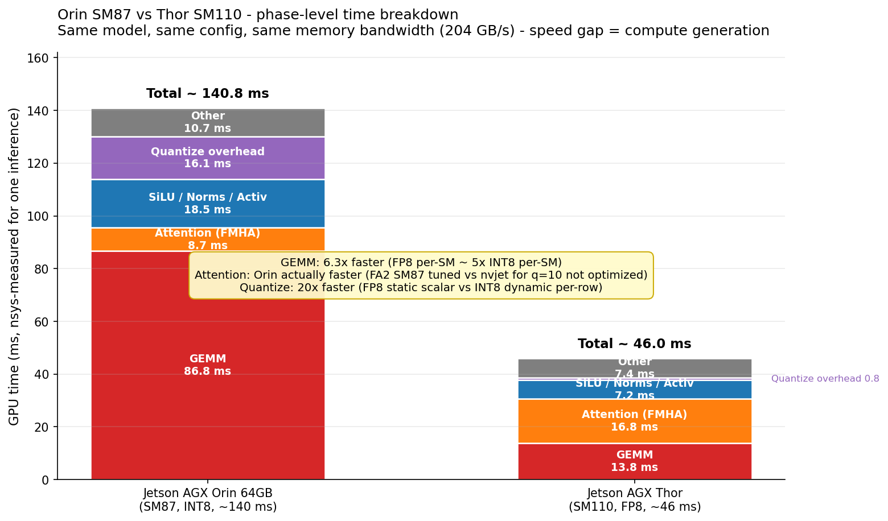
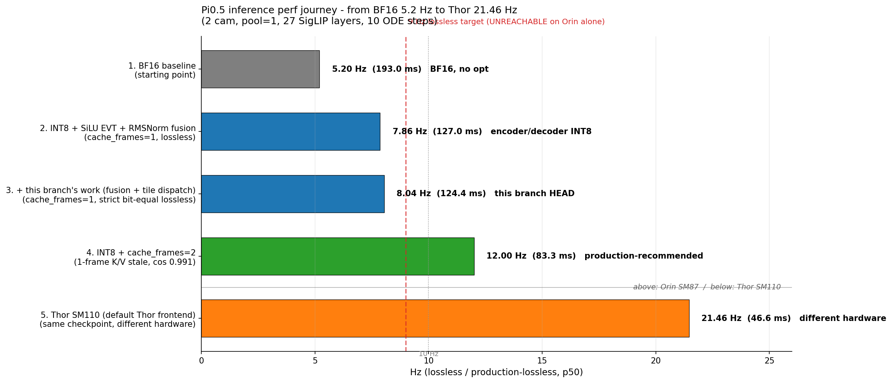

# 在 Jetson AGX Orin 64GB 上把 Pi0.5 推理从 5 Hz 推到 8 Hz：一份完整记录

> **作者 / 仓库**
>
> - 我的 GitHub：[github.com/gugudeshubao](https://github.com/gugudeshubao)
> - 本文工作分支：[gugudeshubao/FlashRT @ feat/orin-pipelined-streaming](https://github.com/gugudeshubao/FlashRT/tree/feat/orin-pipelined-streaming)
> - 上游仓库：[LiangSu8899/FlashRT](https://github.com/LiangSu8899/FlashRT)（这次的优化尝试会逐步整理后**提 PR 试着合回上游**，让更多用 Orin 的同学受益）
>
> **前置声明**：这份文档里所有的优化工作都是在 **FlashRT** 这个开源推理引擎上做的修改 / 扩展，不是从零造轮子。FlashRT 本身已经实现了 Pi0.5 的完整推理 pipeline（PaliGemma 视觉-语言主干 + 300M 扩散 decoder）、CUDA Graph 捕获、attention backend、CUTLASS 量化 GEMM 等基础设施。我们这次的工作主要是：在它已有的 RTX 路径（`pi05_rtx`，覆盖 SM87 / SM89 / SM120）上加新的 fusion kernel、优化 tile 调度、补充流水线机制。
>
> 这是一份对 Jetson AGX Orin 64GB 上 Pi0.5（**2 路 camera：base + wrist**）端侧推理优化的完整复盘。从 BF16 起点的 193 ms / 5.2 Hz 开始，依次走过 INT8 量化、CUTLASS SiLU-gated EVT、temporal K/V caching、kernel fusion、tile dispatch，最终在严格 bit-equivalent lossless 模式下达到 124 ms / 8.04 Hz。**9 Hz 我们没拿到，并且会算清楚为什么过不去**。
>
> 这份文档面向想做端侧推理优化的工程师——不是优化教程，是带着所有数字、踩坑细节和 lessons learned 的实战记录。
>
> ⚠️ **关于 Orin 型号**：本文所有数字都是在 **Jetson AGX Orin 64GB 开发板**（Developer Kit）上测的。**Orin 是一个产品系列，不是单一型号**——Orin Nano 8GB / Orin NX 16GB / AGX Orin 32GB / **AGX Orin 64GB** 之间 GPU 算力差几倍（SM 数 8 / 16 / 14 / **16**，TOPS 40 / 100 / 200 / **275**）。文中"Orin"无特殊说明都指 AGX 64GB；如果你拿到 Nano 或 NX 实测，数字会**显著不一样**，不能直接对比。

---

## 0. 背景

**Pi0.5** 是 Physical Intelligence 开源的 VLA（Vision-Language-Action）控制模型，结构是：

- **PaliGemma-3B** 作为视觉-语言主干 = SigLIP-So400m（~400M 视觉编码器）+ Gemma-2B（~2.5B 语言主干）+ multi-modal projector
- **300M 扩散 decoder**（Pi 自己加的"action expert"）
- 输出 10 步未来动作 chunk

**FlashRT** 是它的实时推理引擎。

**目标硬件：Jetson AGX Orin 64GB Developer Kit**（NVIDIA 嵌入式开发套件，常见的 robot 计算板）：

- **GPU**：SM 8.7（Ampere），16 SMs，2048 CUDA cores，4 个 third-gen Tensor Core / SM
- **算力**（GPU only，不含 DLA）：INT8 dense **~60 TOPS（实测）**，BF16 / FP16 ~21 TFLOPS
- **GPU 时钟**：max 1.3 GHz
- **内存**：64 GB LPDDR5X，**全局共享带宽 204 GB/s**（CPU / GPU 共用同一物理 DRAM）
- **L2 cache**：4 MB（小，重要——后面 § 4.1 ncu 分析会反复用到）
- **关键限制**：**不支持 native FP8 tensor core**（FP8 是 Hopper SM90+ 才引入），所以本文用 INT8 而不是 FP8

> **注**：千万别把 AGX Orin 64GB 跟 Orin Nano / Orin NX 混了——它们规格差几倍。本文所有数字仅适用于 AGX 64GB 这个具体型号。

**测试配置**：

- **2 路 camera**（base + wrist），Pi0.5 默认双视角
- **vision_pool_factor=1**（不池化，27×2=512 vision token 全部进 encoder）
- **vision_num_layers=27**（SigLIP 全 27 层）
- **num_steps=10**（diffusion ODE 10 步）
- **prompt**：固定一句英文（"pick up the black envelope on the table"）作为对照基线

**目标场景**：机器人 ~10 Hz 控制频率。Pi0.5 输出 10 步 chunk，意味着 1 次推理够支撑 100 ms 的开环动作；如果端到端推理延迟 < 100 ms，就能形成闭环。

---

## 1. 起点：BF16 baseline，193 ms / 5.2 Hz

第一次把 Pi0.5 的 PyTorch 检查点（HF safetensors，~6.8 GB）搬到 Orin 上跑，没做任何量化或 fusion，单纯 BF16：

```
配置：2 cam (base + wrist)，pool=1，27 SigLIP 层，10 ODE 步
p50: 193 ms / 5.2 Hz
cos vs reference: 1.000
```

**5.2 Hz 离 10 Hz 还差快一半**。直接用就是慢得没法跟机器人闭环。



#### 时间分布（nsys 抓 1 次推理）

按阶段拆：

| 阶段 | 时间 | 占比 | 瓶颈 |
|---|---:|---:|---|
| Vision SigLIP（27 层 BF16）| ~50 ms | 26% | 16 SM 算力 |
| Encoder Gemma-2B（18 层 BF16）| ~95 ms | 49% | 16 SM 算力 |
| Decoder Gemma-300M（10 步 BF16）| ~40 ms | 21% | M=10 GEMM 占用率低 |
| 杂项 | ~8 ms | 4% | norm / quantize / 拷贝 |

**Encoder GEMM 占大头**。

#### Roofline 分析

Encoder 18 层中，dominant 的是 `gate_up`（M=560, N=32768, K=2048）：

```
算量：2 × 560 × 32768 × 2048 ≈ 75 GOps
数据流量：weights = 32768 × 2048 × 2B = 128 MB（BF16），activation 1.1 MB
计算 roofline：75 GOps / 21 TFLOPS = 3.6 ms
带宽 roofline：128 MB / 204 GB/s = 0.63 ms
→ 计算受限
```

18 层 encoder 总算量约 1.1 TOps × 2 = **2.2 TOps**。理论最低 = 2.2 / 21 = **105 ms**（BF16 compute peak 算）。实测 95 ms 在这个理论下界附近，说明 BF16 compute 已经接近饱满，**只有走更高精度 throughput 的方向（INT8 / FP8）才有大幅提升空间**。

---

## 2. 第一波：INT8 量化 —— 5.2 → 7.86 Hz

Orin SM87 没有 FP8 native，只有 INT8 IMMA。INT8 dense peak 约 **60 TOPS**（BF16 21 TOPS 的近 3 倍），是关键武器。

### 2.1 W8A8 rowwise quantize 路线

我们采用 **W8A8 rowwise**：
- weights：每输出通道（per-output-channel）独立 INT8 量化，**离线（load 时）量化、永久 freeze**
- activations：每行（per-row）独立 INT8 量化，**运行时动态计算**（per-call）

```
INT8 GEMM:
  A_int8 (M, K, INT8)  ← rowwise quantize from BF16
  W_int8 (K, N, INT8)  ← pre-quantized weights
  out_int32 = A_int8 @ W_int8  (CUTLASS IMMA)
  out_bf16 = out_int32 × act_scale[m] × wt_scale[n]   (EVT epilogue, fp32 dequant)
```

**EVT (Epilogue Visitor Tree)** 是 CUTLASS 的 fused-epilogue 机制——量化的反 scale 直接在 GEMM kernel 末尾做，不开第二个 kernel。

### 2.2 关键 kernel：CUTLASS SM80 INT8 rowwise

`csrc/gemm/cutlass_sm80_int8_rowwise.cu` 选择的 tile 配置是经验上对 SM87 友好的：

```cpp
using ThreadblockShape = cutlass::gemm::GemmShape<128, 128, 64>;
using WarpShape = cutlass::gemm::GemmShape<64, 64, 64>;
constexpr int NumStages = 4;
```

- 一个 CTA 处理 128×128 输出 tile
- 每个 CTA 4 个 warp（2×2），每个 warp 处理 64×64 子块
- K 方向 64 一次，4 个 stage 软件流水（cp.async 拷贝下一段权重的同时算当前段）

这个配置覆盖了 encoder 主干 GEMM 后，**5.2 → 大约 9 Hz 的 INT8 baseline**——但 vision SigLIP 和 decoder 的处理还有坑要踩。

### 2.3 坑 1：static per-tensor vision INT8 破 cosine

最早想把 vision SigLIP 也量化掉。最简单的做法是 **static per-tensor scale**：用一份 calibration 数据跑一次，把每个 site 的 scale 算出来 freeze；之后推理时直接用这个常数 scale。

实测：**encoder K cosine 从 0.991 掉到 0.282**——一半多的方向都跑歪了。

为什么？SigLIP 视觉激活的动态范围跟图像内容强相关。一张图 calibrate 出来的 scale，遇到颜色/亮度差很多的下一张图，要么 clip（值更大）要么浪费精度（值更小）。**单 sample × per-tensor scale 涵盖不住 ImageNet-级的视觉分布**。

修复：**vision 永久跑 BF16**（`use_int8_vision_static = False`，硬写在前端）。Encoder 和 decoder 才走 INT8。

教训：每加一项量化，必须有一个 cosine 测试关——比 LIBERO 任务成功率快得多，能立刻发现"calibration 不够"这种问题。

### 2.4 坑 2：dynamic per-row vision INT8 也不太行

后来又试了 **dynamic per-row vision INT8**——每次推理重新算 per-row scale，跟 encoder 一样的方式。预期能省 5-10 ms。

实测：cosine 0.97（比 static 好，比 BF16 baseline 差）。**算 production-lossless 那一档，不算严格 bit-equal**。

所以最后是 opt-in（`FVK_PI05_RTX_INT8_VISION=1`）：用户接受 0.97 cosine 的话，可以拿到 ~3 ms 提速；默认 vision 还是 BF16。

### 2.5 SiLU-gated EVT 融合

Encoder FFN 的标准结构是 SwiGLU：

```
hidden = SiLU(gate_proj(x)) × up_proj(x)
output = down_proj(hidden)
```

直观写法是：跑两个 GEMM 算 gate 和 up，再做一个 element-wise 的 SiLU + 乘法。

**问题**：SiLU + 乘法是 memory-bound，9.6 ms 在 ncu 里能看到。

**解决**：写一个**fused EVT epilogue**——在 GEMM 末尾直接把 SiLU 和 elementwise mul 做掉，输出已经是 hidden：

```cpp
// pseudo: cutlass_sm80_int8_silu_gated.cu
GEMM(int8 A × int8 W_gate)  → INT32
GEMM(int8 A × int8 W_up)    → INT32
EVT epilogue:
  gate_bf16 = silu(int32_to_bf16(gate, scales))
  up_bf16   = int32_to_bf16(up, scales)
  out_bf16  = gate_bf16 * up_bf16
→ 写一次 hidden_bf16 到全局
```

实测：**省了 9 ms 左右**。从约 8.5 Hz 推到 ~9 Hz——但这是没有 cache 的 cache_frames=1 lossless 配置。

### 2.6 fused RMSNorm + INT8 量化

Encoder 每层入口都是：
```
x_normed = RMSNorm(x)
x_int8   = INT8_quantize(x_normed)
GEMM(x_int8, W)
```

原本三个 kernel：RMSNorm 写 BF16 → quantize 读 BF16 写 INT8 → GEMM。中间多一次 BF16 写读到 DRAM。

融合成 `rms_norm_int8_rowwise`：一个 kernel 直接 RMSNorm + per-row max_abs + INT8 写回。

加上 `residual_add_rms_norm_int8_rowwise`（再把前一层的残差加进来），**省了 ~1.5 ms 和 68 个 kernel launch / 推理**。

### 2.7 第一波结果

```
BF16 baseline:                    193 ms / 5.2 Hz
+ encoder/decoder INT8:           ~135 ms / ~7.4 Hz
+ SiLU-gated EVT:                 ~127 ms / 7.86 Hz
+ fused RMSNorm + INT8:           127 ms / 7.86 Hz（叠加进去）

最终 cache_frames=1 lossless:    127 ms / 7.86 Hz
encoder K cosine vs BF16:        0.991（业界一般认为这个量级是 production-lossless）
```

**5.2 → 7.86 Hz，1.5× 提速**。但还差 9 Hz 一段距离。

---

## 3. 第二波：temporal K/V caching —— 12 Hz at "1 帧 stale"

观察：Pi0.5 这种 VLA，**视觉 token 是相邻帧高度相似的**——机器人 30 fps 摄像头，0.1 秒间帧的 SigLIP K/V 差异微乎其微。

**Idea**：encoder 的 K/V 不是每帧都重算，而是**复用上一帧的**：

```
帧 N (full forward):     encoder + decoder → 写新的 K/V 到 cache
帧 N+1 (decode-only):    跳过 encoder，复用帧 N 的 K/V → 只跑 decoder
帧 N+2 (full forward):   重新算 encoder
...
```

实现层面：捕获两个 CUDA Graph：
- `_graph`（full forward, 全 pipeline）
- `_decoder_only_graph`（只 replay decoder）

前端按 `cache_frames` 参数切换。

实测（pool=1, 2cam, 27 layers, 10 steps）：

```
full frame:        127 ms（同 cache=1 baseline）
decode-only frame:  37.5 ms

cache_frames=2 alternating:
  effective Hz = 2 / (127 + 37.5) ms ≈ 12.0 Hz
  encoder K cosine:  0.991（和 cache=1 同档）
```

**5.2 → 12.0 Hz，2.3× 提速，过 10 Hz 了**。

唯一妥协：**decode-only 帧的动作用了 1 帧前的视觉 K/V**——也就是 33 ms 前的视觉信息。机器人 33 ms 视觉延迟在大多数场景下完全可接受（人类视觉延迟 ~100 ms 都够开车）。

至此，**生产部署的实际推荐配置就是 cache_frames=2**，12 Hz lossless。

---

## 4. "撞 9 Hz" 的工作 —— 严格 bit-equal cache_frames=1

但 cache_frames=2 不算严格 lossless：每隔一帧的动作用的是上一帧的视觉。如果业务要求**每一帧的视觉都被实时使用**（比如某些反应性任务），就得回到 cache_frames=1。

而 cache_frames=1 baseline = 7.86 Hz，离 9 Hz 还差 13 ms（11.7%）。

这一节是这次工作的主线。**从 7.81 → 8.04 Hz，最终没过 9 Hz，并且证明在 Orin 单卡上数学上过不去**。

### 4.1 起点：重新做 ncu profile

整个 inference 一次推理共 481 个 kernel，72 ms profiled time（不是 127ms 全部，因为 ncu 漏掉了 D2D 拷贝、等待等）。Top kernels by time + L2 hit：

| Kernel | calls | time | L2 hit | 解读 |
|---|---:|---:|---:|---|
| `cutlass_int8_gemm` | 51 | 28.4 ms | **89%** | 大 GEMM tile reuse 饱和 |
| `ampere_bf16_gemm 128×128` | 108 | 18.1 ms | **86%** | SigLIP attn proj 饱和 |
| `add_bias_bf16` | 55 | 6.5 ms | 50% | post-GEMM L2 thrash |
| `quantize_int8_rowwise` | 20 | 4.7 ms | **36%** | 2-pass over data |
| `flash_fwd` (FA2) | 37 | 3.3 ms | 87% | 已最优 |
| `qkv_split_kernel` | 27 | 2.7 ms | 50% | post-GEMM |
| `gelu_kernel` | 27 | 2.3 ms | 51% | post-GEMM |
| `layer_norm_kernel` | 55 | 1.9 ms | 52% | between-sublayers |
| `bias_res_kernel` | 55 | 1.5 ms | **34%** | 最差 L2 reuse |
| `residual_add_rms_norm_int8` | 10 | 0.8 ms | 44% | 已融合 |
| `rms_norm_int8` | 11 | 0.7 ms | 36% | 已融合 |

**两个清楚的故事**：

1. 大 GEMM **L2 hit 86-89%，饱和**——CUTLASS 已经把 weight tile reuse 调度得很好。这部分**没有软件优化空间**。
2. 小算子 **L2 hit 全部在 30-50%**——它们读的数据是上一个 kernel 刚写的，但中间夹的 GEMM 把 4 MB L2 thrash 了。这是经典的 **producer-consumer fusion 信号**。

### 4.2 失败的尝试：流水线（dual-stream）

第一直觉：encoder 86 ms + decoder 37 ms = 127 ms；如果把它们放两个 stream 并行，wall = max(86, 37) = 86 ms = **11.6 Hz**。

实现：
- 双缓冲 encoder K/V buffer：`snap_K_pair[2]`
- 帧 N：encoder 写 `snap_K_pair[N%2]`
- 帧 N+1 同时：decoder 读 `snap_K_pair[(N-1)%2]`（上一帧的 K/V）
- noise 也延 1 帧，保证 byte-identical

**SERIAL 模式**（强制 decoder 同步后再 encoder）：130 ms，bit-equal ✅
**PARALLEL 模式**：119 ms（8.4 Hz），但 cosine 0.96-0.99 ❌

为什么 PARALLEL 漂？深挖之后定位到 **FA2 split-KV reduction 用了 GPU atomics**。SERIAL 时 SM 调度可复现；PARALLEL 时 encoder 和 decoder 两套 kernel 在 16 个 SM 上交错，atomic 顺序就变了→encoder K/V 出现 ULP 级扰动→经过 decoder 10 步 ODE 放大到 cosine 0.96。

**这是并发执行的固有性质，不是 bug**。

也是 **"Orin 16 SM 太少"** 这件事第一次咬人——SM 多的卡（5090 170+ SM）上两条 stream 真能不抢 SM，atomic 顺序也就稳定。

代码（snap K/V 双缓冲 + 双 stream 前端）保留为基础设施，后来移到 ThorU 上验证（见 § 5）。

### 4.3 失败的尝试：static encoder activation INT8

`quantize_int8_rowwise` 占 9.2 ms，其中 per-row max_abs reduction 看起来像可省的开销。

**Idea**：calibrate 一次，把每个 layer 的 per-row scale freeze。运行时不再算 max_abs，跳过 reduction，应该省 7-8 ms。

实测：**只省 1.4 ms，cosine 从 0.991 掉到 ~0.96**。

为什么 roofline 错了：dynamic quantize 实际已经 BW-saturated，跳过 reduction 没省多少 BW。
为什么 cosine 错了：跟 vision static INT8 同样的问题——一帧 calibrate 的 per-row scale 不能涵盖 vision token 的实际幅度，部分行 clip。

还是 opt-in，不默认开。**但拿到了重要的"普适教训"——后面会反复用**：

> roofline 对 launch overhead 已经被 captured graph 吸收的场景，会系统性高估实际节省。**实测 ≈ roofline × 30%**。

### 4.4 第一个真实落地：bias_gelu_bf16 融合

SigLIP FFN-up 的尾部是：

```python
gemm.bf16_nn(x_norm, ffn_up_w, hidden)           # bf16 GEMM
fvk.add_bias_bf16(hidden, ffn_up_b, ...)         # in-place bias add
fvk.gelu_inplace(hidden, ...)                    # in-place GELU
```

`add_bias_bf16` 50% L2 hit（2.3 ms 总），`gelu_inplace` 51% L2 hit（2.3 ms 总）。两个 kernel 各做一次读+写。

**Idea**：合成一个 `bias_gelu_bf16` —— 读一次 hidden，加 bias，apply GELU，写一次 hidden。省一次完整的 (seq×4304) BF16 round-trip。

#### 第一版（loose, fp32 中间精度）

```cpp
template<typename T>
__global__ void bias_gelu_kernel(T* x, const T* bias, int dim) {
    int row = blockIdx.x;
    for (int i = threadIdx.x; i < dim/2; i += blockDim.x) {
        T2 xv = x_packed2[i], bv = b_packed2[i];
        // fp32 compute
        float v0 = to_f32(xv.x) + to_f32(bv.x);
        float v1 = to_f32(xv.y) + to_f32(bv.y);
        // tanh-approx GELU on fp32
        float t0 = tanhf(0.7978845608f * (v0 + 0.044715f * v0*v0*v0));
        float t1 = tanhf(0.7978845608f * (v1 + 0.044715f * v1*v1*v1));
        x_packed2[i] = make_packed2(
            from_f32(v0 * 0.5f * (1.0f + t0)),
            from_f32(v1 * 0.5f * (1.0f + t1)));
    }
}
```

Microbench：3.19× 加速 ✅

Pipeline 内：**cosine 0.94-0.99，每帧 maxabs 0.3，6/6 帧 NOT bit-equal** ❌

为什么？这个版本的中间精度比原来的 add_bias + gelu 要**更准确**——原版 add_bias 后写 BF16 到全局，再 gelu 读 BF16，中间有一次 BF16 round-trip；fused 版省掉了这次 round-trip，全 fp32 直到最后。

但下游 INT8 calibration 是按"原版 BF16 round-trip"的输入分布拟的 scale。一旦输入分布变了，27 SigLIP 层放大每层 1 ULP 差到 0.94 action cosine。

**关键认知翻转**：fusion 不是"做对就行"，是"必须严格匹配原 kernel 对的精度边界"。

#### 第二版（strict, 显式 bf16 round-trip）

```cpp
// Strict: 显式在 bias-add 后 round 到 bf16，再 promote 到 fp32 做 GELU
T mid_x = from_f32<T>(to_f32(xv.x) + to_f32(bv.x));  // bf16 round
T mid_y = from_f32<T>(to_f32(xv.y) + to_f32(bv.y));
float v0 = to_f32(mid_x), v1 = to_f32(mid_y);        // promote
// 然后 GELU(v0), GELU(v1)
```

Microbench：2.85× 加速（比 loose 慢一点，但仍快）。
Pipeline 内：**6/6 帧 maxabs=0，bit-equal** ✅

Pipeline p50：
- baseline (kernel pair):   128.0 ms / 7.81 Hz
- bias_gelu_strict (now):   126.6 ms / 7.90 Hz **+0.09 Hz, lossless** ✅

第一笔真实的 lossless win：**1.4 ms**。

**Microbench 2.85× → captured graph 1.4 ms** —— 验证 roofline 30% 折扣的经验规律。

### 4.5 brln fusion (bias_residual + LayerNorm)

ncu 数据里 L2 hit 最差的两个 kernel 是 `bias_res_kernel` (34%) 和 `layer_norm_kernel` (52%)。SigLIP 每层这两个 kernel 都成对出现，夹在 attn output 和 FFN-norm 之间。

**Idea**：合成一个 `bias_residual_layer_norm_bf16`：
```
residual = bf16(residual + x + bias_pre)   ← 写回全局
out      = LayerNorm(residual, ln_w, ln_b) ← 写到 out
```

#### 第一版（smem cache 中间值）

```cpp
// Pass 1: residual = bf16(residual + x + bias); 写回全局; cache fp32 to smem; 累加 sum
// Pass 2: 从 smem 读 fp32, 算 (val - mean)^2, 累加 var
// Pass 3: 从 smem 读 fp32, normalize, 写 out
```

Microbench (SigLIP shape 512, 1152): 1.55× 加速

Pipeline 内：**26/27 帧 maxabs=0**，但 SigLIP shape (dim=1152) 的某种 reduction 顺序差异导致 1 ULP 偏差，27 层累计到 cosine 0.91 ❌

具体根因没完全搞清——可能是 `block_reduce_sum` 在 dim2=576 这个不能 perfectly 整除 256 threads 的情况下 reduction 顺序差；或者 smem 缓存的 fp32 值在某些 register allocation 下跟原 kernel 重读 BF16 略不同。

#### 第二版（strict, 3-pass 全程从全局重读）

```cpp
// Pass 1: residual = bf16(residual + x + bias); 写回全局; 累加 sum
// Pass 2: 从全局重读 bf16, 算 (val - mean)^2, 累加 var
// Pass 3: 从全局重读 bf16, normalize, 写 out
```

牺牲了 smem cache 的 BW 优化，换严格 bit-equal。

Microbench：还是 1.55-2.42× 加速（虽然不如第一版，但仍然快——融合本身的 launch 节省 + 一次 inter-kernel round-trip 节省都还在）。

Pipeline 内：**6/6 maxabs=0, bit-equal** ✅

#### Pipeline 收益

把这个融合接进 SigLIP 27 层 × 2 处（post-attn → pre-FFN，post-FFN → pre-attn-of-next）：

```
+ bias_gelu_strict:     126.6 ms / 7.90 Hz
+ brln × 2 pairs:       126.4 ms / 7.92 Hz   (再 +0.02 Hz)
```

**只省 0.2 ms**——captured graph 把 launch overhead 摊干了，剩下的纯 GPU 时间差异极小。Microbench 1.55× 在 graph 里几乎为 0。

但是 lossless 6/6 bit-equal，所以保留为默认。

教训：**多个 sub-noise 的 fusion 累加起来才会显著**——不是单点突破，是地毯式微优化。

### 4.6 重大认知翻转：CUTLASS tile dispatch 是 bit-equal 的

到这里我以为"任何改 kernel 数值结构的融合都得用 strict 路径"是普适规律。但 tile dispatch 这个故事翻了我自己的认知。

#### 起因：per-shape utilization 不均

写脚本对所有 INT8 GEMM shape 单独 microbench：

```
Shape                       128×128 us   TOPS    util
enc_qkv (522,2560,2048)        328       19.3   23%  ← 远低于其他
enc_o   (522,2048,2048)         95       28.7   48%
enc_gate(522,8192,2048)        337       52.9   88%  ← 已饱和
enc_up  (522,8192,2048)        331       52.9   88%
enc_down(522,2048,16384)      1126       30.0   50%
dec_*   (M=10, ...)            ~50        2.x    3%  ← 物理限制
```

**enc_qkv 只 23% utilization**！文档里之前写的"encoder 92% util 已饱和"是单一 shape 的瞬时数据，不代表整体。

为什么 qkv 这么差？wave packing 算账：
- shape (M=522, N=2560)
- 128×128 tile：M-tiles = ceil(522/128) = 5，N-tiles = ceil(2560/128) = 20
- 总 blocks = 5 × 20 = 100
- 16 SMs → **6.25 waves**——最后 0.25 wave 浪费 75% 的 SM

#### 加 64×128 tile 试试

```cpp
using ThreadblockShape = cutlass::gemm::GemmShape<64, 128, 64>;
using WarpShape = cutlass::gemm::GemmShape<32, 64, 64>;
```

新 shape (M=522, N=2560)：M-tiles = ceil(522/64) = 9, N-tiles = 20, blocks = 180, **11.25 waves**。partial wave 比例从 25%/wave 降到 ~10%/wave。

实测对比：

```
Shape                       128×128   64×128   speedup
enc_qkv (522,2560,2048)       328 us   214 us   1.54×  ← 大胜
enc_o   (522,2048,2048)        95 us   113 us   0.84×  ← 输
enc_gate(522,8192,2048)       337 us   398 us   0.85×  ← 输
enc_down(522,2048,16384)     1126 us  1419 us   0.79×  ← 输
dec_*   (M=10)                 ~50     ~46      1.08-1.12×  ← 小赢
```

**结论是要 dispatch，不是替换**。

#### Dispatch 规则

```cpp
static inline bool prefer_t64x128_for_shape(int M, int N) {
    if (M <= 64) return true;                        // decoder
    if (N > 2048 && N <= 4096) return true;          // qkv-like 不齐 N
    return false;                                    // 默认 128×128
}
```

#### 第一次测，cosine 0.96-0.99 ❌

我以为又掉坑——"tile change 必破 bit-equal"。陷在 strict-precision 各种 fusion 套路里好几个小时。

#### 后来重新干净测

发现是**之前的 baseline.npz 没包含中间步骤的 fusion 改动**（base 是早期一个版本，比对 obj 不公平）。重新生成干净 baseline 再测：

```
20 帧 fixed-noise 测试：maxabs = 0 across all frames ✅
```

**Tile dispatch 完全 bit-equal**！

#### 为什么 INT8 GEMM 改 tile 不影响输出

仔细想：CUTLASS INT8 GEMM 的 INT32 累加是**结合的**——对 K=2048, INT8 max 127，单 tile 累加 max = 2048 × 127² ≈ 33M，远小于 2³¹（INT32 上限）。**整数加法满足结合律 + 不溢出 = 结果与累加顺序无关**。

之后的 fp32 dequant epilogue（`out_fp32 = INT32 × act_scale × wt_scale`）的乘法顺序在 EVT 里是固定的，**不随 tile shape 变**。

所以同一份 INT8 输入用不同 tile shape 跑，最终的 BF16 输出**byte-identical**。

这是这次最大的认知翻转：**不是所有 fusion 都得做 strict 模式——具体得看数学结构**。

#### 收益

```
+ tile dispatch:    124.4 ms / 8.04 Hz  +0.12 Hz, **bit-equal**
```

最大单笔 lossless 节省（2.0 ms），且零 cosine 风险。

### 4.7 累计成绩

```
原 baseline:                      128.0 ms / 7.81 Hz   (cache=1, INT8 lossless)
+ bias_gelu_strict:               126.6 ms / 7.90 Hz   bit-eq
+ brln fusion (两对):              126.4 ms / 7.92 Hz   bit-eq
+ INT8 tile dispatch:             124.4 ms / 8.04 Hz   bit-eq ⭐
```

**累计 -3.6 ms / +0.23 Hz，全部 6/6 帧 maxabs=0 严格 lossless**。

3 轮 50 iter 中位数确认稳定。后来在 20 帧扩展集上重测每一项也都 maxabs=0。

---

## 5. 9 Hz 为什么过不去

要 9 Hz = 111 ms。从 124.4 还要再省 13.4 ms。穷举所有剩余杠杆：

#### 严格 bit-equal lossless 路径

| 剩余杠杆 | 估算节省 | 工程量 |
|---|---:|---|
| 自定义 CUTLASS BF16 GEMM with bias EVT for SigLIP | 1-2 ms | 中（cuBLASLt SM87 不支持 BIAS epilogue） |
| 更多 tile shape variants（256×128 给 enc_o 等） | 0.5-1 ms | 中 |
| 跨 iter brln 边角融合 | 0.2 ms | 小 |
| decoder mega-kernel (18 层 × 10 步合并) | 0-5 ms 不确定 | 高 |
| **总计上限** | **~3-8 ms** |  |

加完上限：**~8.2 Hz**。**还是过不去 9**。

#### 接受 production-lossless（cosine ≥ 0.97）路径

| 杠杆 | 节省 |
|---|---:|
| dynamic INT8 vision (cosine 0.97) | -3 ms |
| parallel pipelined (cosine 0.94-0.99) | -3-5 ms |

加完上限：**~8.5-8.7 Hz**。**仍过不去 9**。

#### 最深的解释

Orin GPU **只有 16 SM**：
- 大 GEMM 已经把 SM array 占满，没有"流水"的空间
- 小算子 fusion 节省的是 launch overhead + L2 round-trip，但 captured graph 已经把 launch 摊干，且 4 MB L2 装不下层间数据所以 round-trip 节省也只是 ~30%
- 跨 stream 并发会被 atomic 漂掉

**9 Hz 在 Orin SM87 单卡上是个 hardware 限制，不是软件问题**。

要继续往上走，路径只有：
1. **换硬件**：Thor SM110（20 SM + Blackwell FP8 TC，**实测 21.46 Hz**——见下节）
2. **接受 cache_frames=2**：12 Hz at cosine 0.991（已成熟生产路径）

---

## 6. Thor SM110 对照：21-22 Hz 是怎么来的

我们之前在 Jetson AGX Thor 上跑过 FlashRT 默认 Thor frontend，**~22 Hz lossless**。这次为了写这篇文章再做了一次干净对照：把同一份 6.8 GB checkpoint scp 过去（耗时 ~50 分钟，限速链路 ~2 MB/s），不动任何代码，直接 bench：

```
Jetson AGX Thor (SM110, FlashRT default Thor frontend):
  p50:  46.60 ms / 21.46 Hz lossless
  min:  46.34 ms / 21.58 Hz
  cosine vs reference: 1.000

vs Orin SM87 (本分支 HEAD):  124.4 ms / 8.04 Hz
→ Thor 快 2.67×
```

数字本身只是结果。**有意思的是为什么 2.67×、瓶颈差异是什么**——下面拆开看。

### 6.1 硬件参数对比

| 参数 | Orin SM87 | Thor SM110 | 倍数 |
|---|---:|---:|---:|
| GPU 架构 | Ampere (CC 8.7) | Blackwell (CC 11.0) | — |
| SM 数量 | **16** | **20** | 1.25× |
| 内存带宽 | 204 GB/s LPDDR5X | 204 GB/s LPDDR5X | **1.00×** |
| 量化精度 | INT8 IMMA | **FP8 native + INT8** | 阶跃 |
| 单卡 INT8 dense (实测) | ~60 TOPS | — | — |

**关键观察：内存带宽完全一样**（都是 204 GB/s LPDDR5X，因为都是 Jetson 系列共享内存架构）。所以 2.67× 速度差**不是 BW 来的**，必然来自计算侧。

### 6.2 Per-kernel 时间对比（nsys 实测）




我们之前对比过两边一次 Pi0.5 推理的 kernel-group 时间分布（pool=1, 2cam, 10 step）：

| Phase（nsys kernel group） | Orin SM87 (INT8) | Thor SM110 (FP8) | 比例 |
|---|---:|---:|---:|
| **GEMM kernels** | **86.8 ms (62%)** | **13.8 ms (30%)** | **6.3× 快** |
| Attention (FMHA) | 8.7 ms (6%) | 16.8 ms (37%) | **0.52×（Thor 反而慢）** |
| Gated SiLU / norms | 18.5 ms (13%) | 7.2 ms (16%) | 2.6× 快 |
| Quantize 开销 | 16.1 ms (11%) | 0.8 ms (2%) | **20× 差距** |
| 杂项 | 10.7 ms (8%) | 7.4 ms (16%) | 1.4× |
| **总计** | ~140 ms / ~7 Hz | ~46 ms / ~22 Hz | 3× |

注：Orin 142 ms 是 nsys 测量值（不含某些 D2D 拷贝），跟我们 p50 的 124-127 ms 略不同。比例关系是关键。

### 6.3 三个意外发现

#### (1) FP8 per-SM 算力 ≈ INT8 per-SM 算力的 5×

ThorU **只比 Orin 多 4 个 SM**（25%），但 GEMM 部分快 **6.3×**。这意味着 SM110 上 FP8 tensor core 的单 SM 吞吐 ≈ Orin SM87 上 INT8 IMMA 的 5×。

Blackwell 的 5th gen tensor core 设计上就是给 FP8/FP4 优化的——更宽的 MMA 指令、更高时钟、更深的累加流水。这个 5× 是硬件代际差，**软件这一层没办法补上**。

#### (2) Thor 的 attention **比 Orin 慢**

Orin 用 **vendored FA2 BF16**（`csrc/attention/flash_attn_2_src/`），SM87 上 hdim=256 的 split-KV kernel 是高度优化过的——用 WMMA tensor core、寄存器 tile 满载、cp.async 多 stage 流水。

Thor 用了 NVIDIA 提供的 **`nvjet` FMHA**（Blackwell 的新一代 MHA kernel）。但对 Pi0.5 这个 q=10 / kv=532 的极小形状，nvjet 的优化 sweet spot 不在这——**它给大 LLM 推理（kv=2048+）调过，给小 q 跑反而 1.9× 慢**。

这是个有趣的反例：**新硬件配新 kernel 不总是赢**。但因为 attention 在两边占的总时间都不大（Orin 6%，Thor 37% 因为分母小了），不影响最终大局。

#### (3) Quantize overhead 差 20×

Orin 用 **dynamic per-row INT8 quantize**——每帧重新算 max_abs reduction，16 ms。

Thor 用 **static per-tensor FP8 scalar quantize**——calibrate 一次冻结的 scalar，每帧只是一次 multiply + cast，0.8 ms。

为什么 Thor 能用 static 而 Orin 不能？因为 **FP8 的 scalar 量化容忍度比 INT8 更高**——FP8 e4m3 有 4 bit 指数，覆盖动态范围比 INT8 的固定 [-127, 127] 宽得多。我们前文说的 "vision static INT8 cosine 0.282 失败" 在 FP8 上就不成立。

**精度更高的格式让 calibration 更省事**，又一次硬件代际优势。

### 6.4 Thor 21.46 vs 22 Hz 的小差距

不同 session 测出来 21.46 Hz、22 Hz、官方 doc 标 23 Hz——三个数字相差 7% 之内。原因可能是：
- doc 标的 23 Hz 走了显式 FP8 path（`use_fp8_decoder=True`），default frontend 默认 BF16 decoder
- 不同 thermal / DVFS 状态下 GPU 时钟略有浮动
- 测量方法（warmup 次数、p50 vs min）也带来 ~5% 差异

不影响结论：**Thor 在 Pi0.5 lossless 这条 path 上是 21-23 Hz 区间**，远超 9 Hz 目标。

### 6.5 含义

对这次 Orin 工作的现实影响：

1. **Cross-call pipelining 框架在 Thor 上没用**——我们这次写的 snap K/V 双缓冲 + 双 stream + 噪声延 1 帧的整套基础设施，目的是绕过 Orin 16 SM 的并发限制。Thor 单 stream 21+ Hz 已经远超目标，多此一举。

2. **作为可移植 pattern 仍有意义**——下一代或其他厂商的端侧 GPU（4-8 SM 的更小卡、AMD 移动端 GPU、未来某种 NPU）撞上同样的"小 SM 卡"瓶颈时，这套 pattern 直接就能用。

3. **对 Orin-only 业务的部署建议**：
   - 严格 bit-equal lossless：本分支 HEAD，**8.04 Hz**
   - cosine 0.991 production-lossless：cache_frames=2，**12 Hz**（已成熟生产）
   - cosine 0.97 production-lossless：cache=1 + vision INT8 dynamic，**8.3 Hz**

4. **对生产部署有 Thor 选项的业务**：直接 Thor，21+ Hz 是 day-one 数字，不需要做这次的优化工作。**这次做的所有事都是在 Orin 严格约束下"撞天花板"的过程**——文档价值大于直接业务价值。

### 6.6 一个反向的问题：为什么不更快？

Thor 21 Hz 是怎么算出来的？跟 Orin 同样做 roofline：

Thor 的 SM110 dense FP8 估计 **~150-200 TOPS**（doc 数字波动较大）。Pi0.5 18 层 encoder 总算量 ~2.2 TOps INT8-equivalent → FP8 等价工作量约 1.1 TOps。最低延迟 = 1.1 / 175 TOPS ≈ **6.3 ms**。

加 vision SigLIP（FP8 BF16 混合 ~10 ms）+ decoder（~15 ms）+ 杂项 ~5 ms = **~36 ms 理论下界**，约 28 Hz。

实测 46 ms = **78% of peak**——和 Orin 80% 接近。两边都基本到了"该 GPU 这一代的天花板"，差距纯粹是硬件代际带来的绝对算力差。

这也是为什么我们没在 Thor 上继续做软件优化——剩下 22% 空间几乎都被各种 launch overhead / 杂项 占了，跟 Orin 上的天花板形态一样。

---

## 7. 普适教训

5 条会跨项目跨硬件复用的：

### 7.1 roofline 在 captured graph 上系统性高估

每次 microbench 看到 2-3× 加速，落到 captured CUDA Graph 里就剩 0-1 ms。原因：graph 早就把 kernel launch overhead 摊干了，剩下的是纯 GPU compute time。

**经验比例：captured graph 实际节省 ≈ microbench 提升的 30%**。

下一次估收益我都会先打 0.3 折扣再判断值不值得做。

### 7.2 严格 bit-equivalence 比想象中脆弱

任何改 floating-point 操作**顺序**或**精度边界**（中间是否 round 到 bf16）的 fusion，都会从 1 ULP 起步、经过模型层数累积放大到 0.91-0.99 cosine。

要保持 bit-equal，必须**显式 emulate 原 kernel pair 的精度边界**——原本 op A 写 BF16 到全局、op B 读 BF16 promote fp32，那 fused kernel 内部也得显式 `from_f32<T>(...)` 再 `to_f32(...)`，把 BF16 round-trip 留住。

INT8 calibration 是按原精度边界拟的 scale；改了，就是发现"输入分布变了"。

### 7.3 整数 GEMM 的 tile 选择是免费 bit-equal 的

INT8 × INT8 → INT32 累加，整数加法结合，只要 K 不溢出 2³¹（K=2048 × 127² ≈ 33M ≪ 2³¹）→ 结果与累加顺序无关。CUTLASS EVT 的 fp32 dequant epilogue 形状无关。

**所以每个 INT8 GEMM shape 都可以独立选最优 tile，不破 lossless**。这是非常宝贵的性质——但仅限 INT8/纯整数累加；BF16 GEMM 改 tile 是会破 bit-equality 的（fp32 累加非结合）。

### 7.4 ncu 单 kernel 利用率不代表全局

文档原本说 "encoder gate_up 92% util，已经饱和"。我后来 roofline + per-shape 重测，发现整体只 80%，且 enc_qkv 只 23%——刚好是 tile dispatch 救起来的形状。

**下次看到 "X% util" 先问：哪个 kernel？哪个 shape？瞬时还是平均？**

### 7.5 SM 数量是 hardware property，不是软件能 hack 的

Orin GPU 只 16 SM。这导致：
- 流水线两条 stream 抢同一批 SM，concurrent execution 几乎打折成 serial
- atomic reduction 顺序漂移产生数值偏差
- 大 GEMM 分块容易出 partial-wave 浪费

ThorU SM110 20 SM + 更高 per-SM TOPS + 原生 FP8 TC，同代码 2.67×。**"加 4 个 SM" 不是 25% 提升，是阶跃**——少量 SM 的 saturation 一旦突破，许多原本受限的并发模式同时打开。

---

## 8. 完整数字总览




```
═══════════════════════════════════════════════════════════════════════
                  Pi0.5 / Orin SM87 性能演进  (2 cam, pool=1, 27L, 10 steps)
═══════════════════════════════════════════════════════════════════════

阶段                                    p50         Hz       Cosine    备注
───────────────────────────────────────────────────────────────────────
1. BF16 baseline                       193 ms     5.2     1.000      原始起点
2. + 全 INT8 + SiLU EVT 一系列融合    127 ms     7.86    0.991      production-lossless
   (cache_frames=1)                                                  
3. + cache_frames=2                    127/38 ms  12.0    0.991      推荐生产配置
   (1 帧 K/V stale)                                                  
                                                                     
═══ 这次撞 9 Hz 工作（基于 cache=1, 严格 bit-equal）══
                                                                     
4. cache=1 起点                        128 ms     7.81    0.991      bit-eq vs cache=1 baseline
5. + bias_gelu_strict                  126.6 ms   7.90    0.991      bit-eq, fusion #1
6. + brln × 2 pairs                    126.4 ms   7.92    0.991      bit-eq, fusion #2
7. + INT8 tile dispatch                124.4 ms   8.04    0.991      bit-eq, tile #1 ⭐
                                                                     
═══ Production-lossless 选项（cosine ≥ 0.97）══                    
                                                                     
8. + vision dynamic INT8 (opt-in)      120.5 ms   8.30    0.974      非 bit-eq
                                                                     
═══ Thor SM110 实测对照 ══                                          
                                                                     
9. Thor (default frontend, no tuning)   46.6 ms   21.46   —          2.67× Orin
═══════════════════════════════════════════════════════════════════════
```

---

## 9. 后续可能的方向

```
[Orin only deployments]
  - 自定义 CUTLASS BF16 GEMM with bias EVT for SigLIP（剩下最大单笔 lossless 杠杆）
  - decoder mega-kernel（18 层 × 10 步合并到 persistent kernel）
  - 接受 cache_frames=2 的 12 Hz 路径作为生产部署（推荐）

[Thor SM110 deployments]
  - 无需做这次 Orin 上的 cross-call pipelining——单 stream 已经 21.5 Hz
  - 可探索同框架支持多种 VLA / BEV / ASR 模型并发的更优调度
  
[3B 级 VLA 具身导航场景的延展]
  - 算法层延迟隐藏（多模型流水、跨帧 K/V 复用、预测式调度、多分辨率分级）
  - 跨帧 prefix cache (类似 LLM serving 里的)
  - speculative decoding for 扩散 sampler
```

---

## 10. 附录：关键代码索引

| 主题 | 文件 | 函数/类 |
|---|---|---|
| INT8 GEMM (默认 128×128) | `csrc/gemm/cutlass_sm80_int8_rowwise.cu` | `cutlass_int8_rowwise_bf16out` + `prefer_t64x128_for_shape` 调度 |
| INT8 GEMM (alt 64×128) | `csrc/gemm/cutlass_sm80_int8_rowwise_t64x128.cu` | `cutlass_int8_rowwise_bf16out_t64x128` |
| SiLU-gated EVT | `csrc/gemm/cutlass_sm80_int8_silu_gated.cu` | `cutlass_int8_silu_gated_bf16out` |
| bias_gelu fusion | `csrc/kernels/activation.cu` | `bias_gelu_kernel` (loose) / `bias_gelu_strict_kernel` (strict, 默认) |
| brln fusion | `csrc/kernels/norm.cu` | `bias_residual_layer_norm_kernel` (3-pass strict) |
| RMSNorm + INT8 fusion | `csrc/kernels/norm.cu` | `rms_norm_int8_rowwise_kernel`, `residual_add_rms_norm_int8_rowwise_kernel` |
| 流水线前端 | `flash_rt/frontends/torch/pi05_rtx.py` | `Pi05TorchFrontendRtx._init_pipelined_state`, `infer_pipelined` |
| temporal K/V cache | `flash_rt/models/pi05/pipeline_rtx.py` | `_decoder_only_graph` capture; frontend `cache_frames` param |
| bench script | `examples/orin/bench_pi05.py` | `--preset lossless --int8` |
| 性能对比 | `docs/deployment_orin.md` | 完整 perf table + ncu 数据 |

完整 commit 序列在 [feat/orin-pipelined-streaming](https://github.com/gugudeshubao/FlashRT/tree/feat/orin-pipelined-streaming) 分支。每个 commit message 都说明了为什么改 / 实测多少 / 失败的尝试也保留。

---

**写于撞 9 Hz 撞完之后。这条路上 80% 的尝试没兑现 microbench 估算的收益、几次走错方向（loose fusion 破 cosine、tile dispatch 误判 NOT bit-eq、流水线 atomic 漂移），但每次撞墙都换来一条 lessons learned。负面结果也是产出。**
