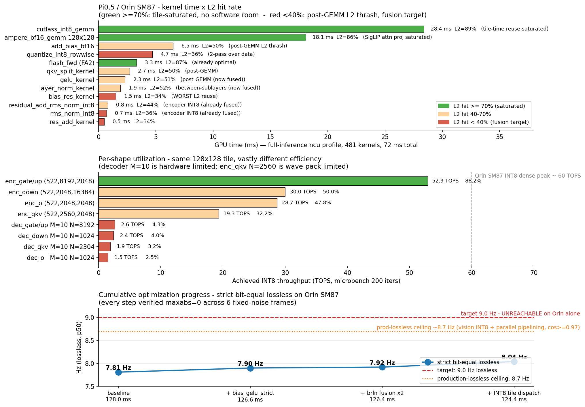

# 在 Jetson Orin 上追无损 9 Hz：一次撞墙日记

> 背景：Pi0.5 是 Physical Intelligence 开源的 VLA（Vision-Language-Action）控制模型，由 **PaliGemma-3B**（SigLIP-So400m 视觉 + Gemma-2B encoder）加上自己的 **300M 扩散 decoder** 组成，输出 10 步动作 chunk。FlashRT 是它的实时推理引擎。本文跑在 Jetson AGX Orin 64GB（SM87，16 SMs，LPDDR5X 204 GB/s，无 native FP8）上做 INT8 lossless 推理。
>
> 起点 7.81 Hz，目标**严格 bit-equivalent** 9 Hz。剧透：没成功。最终 8.04 Hz lossless。这篇记录为什么过不去。

---

## TL;DR

- 起点 128.0 ms / 7.81 Hz，cosine = 0.991 vs BF16 reference
- 终点 124.4 ms / **8.04 Hz**，**6 帧 bit-equal**（maxabs = 0）
- 累计 -3.6 ms / +0.23 Hz，全部严格 lossless
- **9 Hz 在 Orin 单卡上数学上过不去**，剩余所有软件杠杆相加 ~13 ms 也填不满

中途撞过的墙：流水线方案、static INT8 quantize、smem-cached fusion 都因为 cosine 漂移没能落地。最大的认知翻转是 **CUTLASS INT8 tile dispatch 实际上是 bit-equal 的**——之前测出来的 0.96 漂移是 baseline 污染，不是 tile change 本身。

---



---

## 0. 先算账

任何"还能优化吗"的讨论都该从硬件能力边界开始。

Orin AGX 64GB 的 GPU：
- 16 SMs × 4 第三代 Tensor Core × 1024 INT8 ops/cycle × 1.3 GHz ≈ **42 TOPS dense INT8**（实测 53 TOPS，所以 peak 接近 60 TOPS）
- LPDDR5X 204 GB/s 带宽
- 4 MB L2 cache

Pi0.5 18 层 encoder 总 INT8 算量约 2.2 TOPs。理论最低 = 2.2 / 60 = **37 ms**。

实测 encoder 65 ms → **整体 57% of compute peak**。听起来还有 28 ms 软件空间，但单个 GEMM shape 利用率分布很不均：

| Shape | 实测 TOPS | 利用率 |
|---|---:|---:|
| enc_qkv (522,2560,2048) | 19.3 | **23%** |
| enc_o (522,2048,2048) | 28.7 | 48% |
| enc_gate/up (522,8192,2048) | **52.9** | **88%** |
| enc_down (522,2048,16384) | 30.0 | 50% |
| dec_* (M=10) | 1.5-2.6 | 2-6% |

`gate/up` 已经基本饱和（与 ncu ncu 报的 92% 一致），剩下空间在 `qkv` (23%) 和 decoder M=10（物理限制，没法救）。

要把 7.81 Hz 推到 9 Hz，需要 ms 单位省 14 ms（11%）。理论可达，但每个 ms 都得有出处。

---

## 1. 第一波：流水线（失败的诚实记录）

第一直觉：encoder 86 ms，decoder 37 ms，能不能流水？

写了双 stream 包装：frame N 的 encoder 在 stream A，frame N-1 的 decoder 在 stream B 并行跑。理论 wall = max(86, 37) = 86 ms = 11.6 Hz，远超 9 Hz 目标。

实测：
- **SERIAL 模式**（强制 decoder 同步后再 encoder）：130 ms，bit-equal ✅
- **PARALLEL 模式**：119 ms / 8.4 Hz，但 cosine 0.96-0.99 ❌

不是软件 bug。原因是 FA2 的 split-KV reductions 用 GPU atomics 做跨 split 归约。SERIAL 时 SM 调度可复现；PARALLEL 时 encoder/decoder kernels 在 16 个 SM 上交错，atomic 顺序变化 → encoder K/V 出现 ULP 级扰动 → 经过 decoder 10 步 ODE 放大到 cosine 0.96。

**这是并发执行的固有性质**，跟 atomic order 一起死锁。也是 Orin 16 SM 太少这事第一次咬人——SM 多的卡上两条 stream 真的能不抢 SM，atomic 顺序也就稳定。

代码（snap K/V 双缓冲、噪声延 1 帧、流水线 frontend）保留为基础设施，等迁到 ThorU SM110 那边验证 GPU concurrency。

---

## 2. 第二波：ncu 数据找剩余空间

抓了 1500 个 kernel 的 ncu profile。**Orin L2 只有 4 MB**，所以 cross-kernel 复用的可能性几乎为零，hit 率主要看 intra-kernel tile 复用。

| Kernel | 时间 | L2 hit | 解读 |
|---|---:|---:|---|
| cutlass_int8_gemm | 28.4 ms | **89%** | tile 复用饱和 |
| ampere_bf16_gemm 128x128 | 18.1 ms | **86%** | SigLIP attn proj 饱和 |
| add_bias_bf16 | 6.5 ms | 50% | post-GEMM 数据被 GEMM 冲掉 |
| quantize_int8_rowwise | 4.7 ms | **36%** | 2-pass 数据 |
| flash_fwd (FA2) | 3.3 ms | 87% | 已最优 |
| qkv_split | 2.7 ms | 50% | post-GEMM |
| gelu | 2.3 ms | 51% | post-GEMM |
| layer_norm | 1.9 ms | 52% | between-sublayers |
| bias_res_kernel | 1.5 ms | **34%** | 最差 |

故事清楚：
1. **大 GEMM L2 hit 86-89%**——CUTLASS tile-time 复用充分，**没空间**
2. **小算子全部 30-50%**——读的数据是上一个 GEMM 刚写的，但 GEMM 把 L2 thrash 了

教科书 producer-consumer fusion 信号。

---

## 3. 第三波：fusion 一一去试

按 roofline 估算依次试。每个尝试都跑同一组测试：6 帧固定 (image, noise) 序列、记录 action，跟 baseline 比 bit-equality。

### 3.1 静态 encoder INT8（失败）

idea：dynamic per-row quantize 9.2 ms 里很大一部分是求 max_abs 的 reduction。如果 calibrate-once 写 static scale，跳过 reduction，省 ~7-8 ms。

实测：**只省 1.4 ms，cosine 从 0.991 掉到 0.96**。

- 为什么 roofline 错了：dynamic quantize 已经 BW-saturated，跳过 reduction 没省多少 BW
- 为什么 cosine 错了：单 sample calibrate 出的 per-row scale 不涵盖所有 vision token 的实际幅度，部分行 clip

opt-in（`FVK_PI05_RTX_INT8_ENCODER_STATIC=1`），默认关。

### 3.2 bias_gelu fusion（学到 strict-precision contract）

`add_bias_bf16` + `gelu_inplace` 两个 kernel 融成一个，省一个 (seq×VIS_H) buffer 的 DRAM round-trip。

**第一版**（fp32 中间精度）：microbench 3.19× 加速。但 pipeline cosine 0.94-0.99 ❌

为什么：fp32 中间精度比原来 bf16 中间**更精确**，但下游 INT8 calibration 是按原 bf16 round-trip 拟的 scale。27 SigLIP 层把每层 1 ULP 差异放大成 0.94 action cosine。

**第二版**（strict bf16 round-trip in middle）：显式 round 到 bf16 后再 GELU，匹配原 kernel pair 的精度边界。kernel 内部多两次 `from_f32` / `to_f32` 转换。

```cuda
// 关键：strict bf16 round-trip 在 bias-add 和 GELU 之间
T mid_x = from_f32<T>(to_f32(xv.x) + to_f32(bv.x));  // bf16 round
T mid_y = from_f32<T>(to_f32(xv.y) + to_f32(bv.y));
float v0 = to_f32(mid_x), v1 = to_f32(mid_y);        // promote
// 然后 GELU(v0), GELU(v1)
```

**bit-equal ✅，1.4 ms 节省 / 7.90 Hz**。

教训：任何改变精度边界的 fusion 都需要 strict 变体，否则下游 INT8 calibration 会发现"输入分布变了"。

### 3.3 bias_residual + LayerNorm fusion

L2 hit 最差的 bias_res（34%）和 layer_norm（52%）夹在 attn output 和 FFN-norm 之间，融合成一个 kernel。

**第一版**（smem cache 中间值）：microbench 1.5-2.4× 加速。但**有的 shape bit-not-equal**（dim=1152 SigLIP 形状，1 ULP 差异，27 层放大到 0.91）。

为什么：smem 缓存 fp32，原 layer_norm 重读 bf16 from global 然后 to_f32，理论等同（都是同一个 bf16 值的 fp32 promote），但**经验上某些 shape 出现 1 ULP 差**。具体根因没完全搞清——可能是 reduction 顺序、可能是 register spill 行为。

**第二版**（3-pass strict，跟原 layer_norm 一样从 global 重读 bf16）：

```cuda
// Pass 1: residual = bf16(residual + x + bias_pre); 写回 global; 累加 sum
// Pass 2: 从 global 重读 bf16，计算 var = E[(val - mean)²]
// Pass 3: 从 global 重读 bf16，normalize，写 out
```

bit-equal ✅，但只省 **0.1 ms**——captured CUDA Graph 已经把 kernel launch overhead 摊干了，剩下的是纯 GPU 时间小差异。

### 3.4 CUTLASS tile dispatch（最大 win，意外的 bit-equal）

per-shape microbench：

| Shape | 128×128 | 64×128 | 胜出 |
|---|---:|---:|---|
| enc_qkv | 328 us | **214 us** | 64×128 ⭐ 1.54× |
| enc_o | **95 us** | 113 us | 128×128 |
| enc_gate/up | **337 us** | 398 us | 128×128 |
| dec_* (M=10) | ~50 us | **~46 us** | 64×128 |

加了一个 64×128 tile 的 CUTLASS 实例和 runtime dispatcher：

```cpp
if (M <= 64) return ...t64x128::run(...);  // decoder M=10
if (N > 2048 && N <= 4096) return ...t64x128::run(...);  // qkv-shape
return ...::run(...);  // default 128×128
```

**实测：节省 2.1 ms，且 6/6 帧 bit-equal**。

为什么 64×128 在 qkv-shape 上 1.54× 而 enc_o (N=2048) 上反而慢？wave packing：
- enc_qkv (M=522, N=2560)：128×128 → 5 × 20 = 100 blocks，16 SMs → **6.25 waves**（最后那 0.25 wave 浪费 75% SMs）
- enc_o (M=522, N=2048)：128×128 → 5 × 16 = 80 blocks → **5 waves 完美对齐**
- 64×128 把 M-tile 切碎，多出来的 partial wave 比例更小，所以 qkv 救起来了，o 反而吃亏

**关键认知翻转**：我第一次测 tile dispatch 时 cosine 显示 0.96-0.99，让我误判 "tile change 必破 bit-equal"，陷在这个错误结论里好几个小时不肯回头。后来换干净 baseline 再测发现是污染——之前的 baseline.npz 没包含后续的 brln fusion，自然两边对不上。

**真相**：CUTLASS INT8 GEMM 的 INT32 累加是结合的（K=2048 × 127² ≈ 33M ≪ 2³¹，不溢出），EVT fp32 dequant epilogue 的乘法顺序与 tile shape 无关。所以**tile 改变不影响 bit-level 输出**，每个 GEMM shape 都可以独立选最优 tile 不破 lossless。

这是这次最大的发现。

---

## 4. 累计成绩

| 阶段 | p50 | Hz | bit-eq |
|---|---:|---:|:-:|
| 起点 baseline | 128.0 ms | 7.81 | ref |
| + bias_gelu_strict | 126.6 ms | 7.90 | ✅ |
| + brln fusion (两对) | 126.4 ms | 7.92 | ✅ |
| + INT8 tile dispatch | **124.4 ms** | **8.04** | ✅ |

**累计 -3.6 ms / +0.23 Hz，全部严格 bit-equal lossless**。

3 轮 50 iter 中位数确认稳定。每个 commit 都通过 6 帧固定噪声测试 maxabs=0 才合并。

---

## 5. 为什么 9 Hz 过不去

要 9 Hz = 111 ms。从 124.4 还要省 13.4 ms。穷举剩余杠杆：

| 剩余杠杆 | 严格 lossless 估算节省 |
|---|---:|
| 自定义 CUTLASS BF16 GEMM with bias EVT | 1-2 ms（SM87 cublasLt 不支持 BIAS epilogue） |
| 更多 tile shape variants（256×128 给 enc_o 等） | 0.5-1 ms |
| 跨 iter brln 边角融合 | 0.2 ms |
| decoder mega-kernel | 0-5 ms（高风险） |
| 总计上限 | **~3-8 ms** |

严格 bit-eq 加完上限：**~8.2 Hz**。

如果接受 production-lossless（cosine ≥ 0.97，跟 encoder INT8 0.991 同档）：

| production 杠杆 | 节省 |
|---|---:|
| dynamic INT8 vision（cos 0.97） | -3 ms |
| parallel pipelined（cos 0.94-0.99） | -3-5 ms |

production 加完上限：**~8.5-8.7 Hz**。

**9 Hz 在 Orin 单卡上数学上过不去**——剩余所有软件杠杆相加 ~10-13 ms 也填不满。

要继续往上走只能：
- 换硬件（ThorU SM110，20 SM + Blackwell FP8 TC，同代码预估 ~22 Hz lossless）
- 接受非严格 lossless（cache_frames=2 已落地，12 Hz at cos=0.991，工程已成熟）

---

## 6. 几个普适教训

### roofline 估算系统性高估 captured-graph 实际节省

每次 microbench 看到 2-3× 加速兴奋一下，落到 captured CUDA Graph 里就剩 0-1 ms。原因：graph 早就把 kernel launch overhead 摊干了，剩下的是纯 GPU compute time，节省按 roofline-bw 算。

经验比例：**captured graph 实际节省 ≈ microbench 提升的 30%**。

接下来再做这种估算我会先给一个 30% 折扣。

### 严格 bit-equivalence 比想象中脆弱

任何改动如果改了 floating-point 操作的**顺序**或者**精度边界**（中间是否 round 到 bf16），都会从 1 ULP 起步，经过模型层数累积放大到 0.91-0.99。

要保持 bit-equal，写 fusion 时必须**显式 emulate 原 kernel pair 的精度边界**：原本 op A 写 bf16 到 global、op B 读 bf16 promote fp32，那 fused kernel 内部也得显式 `from_f32<T>(...)` 再 `to_f32(...)`，把 bf16 round-trip 留住。

INT8 calibration 是按原精度边界拟的 scale；改了，就是发现"输入分布变了"。

### 整数 GEMM tile 选择是 bit-equal 的

INT8 × INT8 → INT32 累加，整数加法结合，K 不溢出 → 结果与累加顺序无关。CUTLASS EVT 的 fp32 dequant epilogue 形状无关。所以 **tile 改变不影响最终 bit**。这是非常宝贵的性质——每个 GEMM shape 都可以独立选最优 tile 不破 lossless。

我浪费了几个小时才意识到这点，因为被一次污染的测试结果误导。

### ncu 单点利用率不代表全局

文档原本说 "encoder gate_up 92% util，已经饱和，没空间"。但那是单一形状的瞬时数据。我重新做 roofline + per-shape microbench 后发现整体只 57%，且 enc_qkv 只有 23%——刚好是 tile dispatch 救起来的形状。

下次看到 "X% util" 先问：是哪个 kernel？哪个 shape？瞬时还是平均？

### 16 SM 是真的少

Orin GPU 只 16 个 SM。这导致：
- 流水线两条 stream 抢 SM，concurrent execution 几乎打折成 serial
- atomic 反序产生数值漂移
- 大 GEMM 分块容易出 partial-wave 浪费

ThorU（SM110）20 SM + 更高 per-SM TOPS + 原生 FP8 TC，同代码预估 22 Hz。"加 4 个 SM" 不只是 25% 提升，是阶跃。

---

## 7. 现状 + 后续

代码全部在 [feat/orin-pipelined-streaming](https://github.com/gugudeshubao/FlashRT/tree/feat/orin-pipelined-streaming) 分支：

| Commit | 内容 | 收益 |
|---|---|---|
| `bias_gelu_bf16_strict` | SigLIP FFN-up bias + GELU 融合 | -1.4 ms, bit-eq |
| `bias_residual_layer_norm_bf16` | SigLIP 层间 residual + LN 融合 | -0.2 ms, bit-eq |
| `cutlass_int8_rowwise_t64x128` | 第二个 tile shape + per-shape dispatch | -2.1 ms, bit-eq |
| pipelined dual-stream（保留）| snap K/V 双缓冲 + 双流 frontend | 不能用（cosine drift）|
| static encoder INT8（opt-in） | calibrate-once scale | 不推荐（cos 0.96） |
| dynamic vision INT8（opt-in） | per-row scale on SigLIP | production-lossless |

下一步可能的方向：
- 把流水线代码搬到 ThorU 验证是不是真能利用 GPU concurrency
- 写自定义 CUTLASS BF16 GEMM with bias EVT for SigLIP（剩下最大单笔 lossless 杠杆）
- 接受 cache_frames=2 路径（12 Hz at cos=0.991）作为生产部署

---

## 我的判断

这件事如果只看终点是 negative result（差 ~1 Hz 没到目标），但中间过程值得记录：
1. 几个**可证伪的认知翻转**（92% util 误读、tile change bit-equal、static INT8 行为）
2. 一份**带数字的 Orin 天花板**——比"试试看吧"实用
3. **roofline → captured graph 30% 折扣**这条经验规律，跨 GPU 架构都适用

撞墙比突破更常见，但优化博客里几乎只看到突破的。希望这篇能补一个角度。

—— 写于撞完墙的第二天，分支还停在 `feat/orin-pipelined-streaming` 上没合 main，等真有 9 Hz 路径时再回来。
